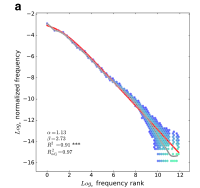
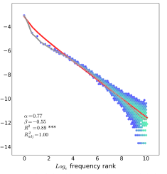

## Describing what happens precisely {.statement-slide}

Probability and statistics give us a language for stating what can happen and how often it happens.

## This Module {.compact}

1. **August 31:** What linguistic data can describe
2. **September 2:** Outcomes, events, and probability spaces
3. **September 9:** Joint, conditional, and independent events

## Welcome {.section-slide}

August 31

## I am Aaron White

I am an associate professor in Linguistics and Computer Science.

My office is 511A Lattimore Hall. My website is [aaronstevenwhite.io](https://aaronstevenwhite.io/).

::: {.notes}
[Sources]

https://aaronstevenwhite.io/
:::

## State the statistical objects

Every analysis must state its observational unit, variables, target population, and target quantity.

These objects are fixed by the study design and the scientific question, not by the layout of a data file.

## Observational unit

**Definition** The observational unit is the entity or event represented by one observation in the analysis.

One recording may contain many word-token observations. One speaker-level observation may combine several recordings.

## Variables

**Definition** A variable assigns a value to each observational unit.

A vowel-token unit may have duration and formant variables. A sentence-reading unit may have a reading-time variable and condition labels.

## Target population and sample

**Definition** The target population is the collection of units to which the intended claim applies. The sample is the collection of units observed in the study.

The target population must be named. More observations from one speaker do not create observations from additional speakers.

## Estimand

**Definition** An estimand is the population quantity that an analysis is intended to estimate.

For a two-condition study, one possible estimand is the difference between the two population means. The response, conditions, and population must be specified before that difference is interpretable.

## Probability and statistics

Probability starts with a probability model and derives properties of possible observations.

Statistics starts with observed data and uses a model to estimate unknown population quantities or predict unobserved outcomes.

## The course studies distinct data structures {.small}

| data structure | one possible observational unit | one possible response |
|---|---|---|
| corpus | construction token | construction choice |
| experiment | participant by item trial | reading time or judgment |
| acoustic study | vowel token | duration or formant value |
| typological database | language by feature | coded feature value |

The analysis must retain every identifier needed to represent repeated speakers, items, words, languages, or documents.

## Six questions organize the course

::: {.incremental}
1. What can happen under the representation?
2. How can a variable describe those possibilities?
3. What does a probability distribution say about the variable?
4. What can a sample tell us about a larger population?
5. How does a model connect a linguistic predictor to a response?
6. How do we check the resulting description?
:::

## Course requirements {.section-slide}

Fall 2026

## We meet on Mondays and Wednesdays

Class meets from **12:30 PM to 1:45 PM** in **Lattimore 513**.

The first meeting is **Monday, August 31**. The final class meeting is **Monday, December 14**.

## Weeks 1 to 4: probability {.compact}

::: {.incremental}
1. **August 31, September 2, and September 9:** linguistic data, probability spaces, and events
2. **September 14 and 16:** random variables and discrete distributions
3. **September 21 and 23:** continuous and joint distributions
:::

## Weeks 5 to 8: inference and prediction {.compact}

::: {.incremental}
1. **September 28 and 30:** populations, samples, and uncertainty
2. **October 5 and 7:** paired inference and linear regression
3. **October 14:** multiple regression and model criticism
4. **October 19 and 21:** prediction, loss, and grouped validation
:::

## October 26 and 28

**Monday, October 26** is the review class.

**Wednesday, October 28** is the midterm and the LING 414 proposal deadline.

## November: responses and data structures {.compact}

::: {.incremental}
1. **November 2 and 4:** binary, count, and bounded responses
2. **November 9 and 11:** experimental design and generalization
3. **November 16 and 18:** mixed models for ordinal and bounded responses
4. **November 23:** clustering and mixture models
5. **November 30:** factorization
:::

## December: missing data and custom models {.compact}

::: {.incremental}
1. **December 2:** missing data and custom model design
2. **December 7, 9, and 14:** LING 414 final project presentations
3. **December 18 to 23:** LING 414 oral assessments
:::

## We do not meet on three scheduled dates

::: {.incremental}
1. **Monday, September 7:** Labor Day
2. **Monday, October 12:** Fall Break
3. **Wednesday, November 25:** Thanksgiving recess
:::

## The course is four credits

We meet for two 75 minute sessions each week.

Plan for at least **480 minutes of work outside class each week** for notes, readings, problem sets, and project work.

LING 110 with a grade of C minus or better is the prerequisite.

## The notes are the course textbook

Each chapter introduces one principal concept and links back to the chapters it requires.

Readings appear in the chapter where they become useful, together with an explanation of what to take from them.

## Three textbooks support the notes {.small}

::: {.incremental}
1. Nicenboim, Schad, and Vasishth, *An Introduction to Bayesian Data Analysis for Cognitive Science*
2. Winter, *Statistics for Linguists: An Introduction Using R*
3. Kruschke, *Doing Bayesian Data Analysis*
:::

The course also uses linguistics papers when their data or arguments bear directly on the method.

## We will work in R

Install **R** and either **RStudio** or **Visual Studio Code**.

Installation instructions and troubleshooting belong on the course Zulip.

## LING 214 has three assessment components {.compact}

| component | weight |
|---|---:|
| five problem sets | 65 percent |
| midterm on October 28 | 25 percent |
| two office hour meetings | 10 percent |

## LING 414 includes a final project {.compact}

| component | weight |
|---|---:|
| five problem sets | 40 percent |
| midterm on October 28 | 20 percent |
| final project | 40 percent |

## Five problem sets {.compact}

::: {.incremental}
1. **Problem Set 1:** October 7, paired vowel measurements
2. **Problem Set 2:** October 21, reading time prediction across passages
3. **Problem Set 3:** November 11, dative construction choice
4. **Problem Set 4:** November 23, discourse commitment judgments
5. **Problem Set 5:** December 7, phonological inventory structure
:::

## Problem sets are readings

Each problem set develops an analysis that the notes prepare you to understand.

Working through the code and interpreting its output are part of learning the next portion of the course.

## Two assessments per problem set

::: {.incremental}
1. Functionality and completeness contribute 50 percent.
2. An in class explanation contributes 50 percent.
:::

Students are selected at random to present and will not know in advance whether they are presenting.

## Be ready to explain your analysis

All students must attend and be prepared to present on any assessment day following a due date.

The assessment concerns what the code does, why the analysis answers the question, and what the result means.

## The LING 414 project has five deadlines {.compact}

::: {.incremental}
1. **October 16:** preproposal meeting completed
2. **October 28:** proposal due
3. **December 7, 9, or 14:** presentation
4. **December 14:** paper and code due
5. **December 18 to 23:** code oral assessment
:::

## LING 414 projects can take three forms

::: {.incremental}
1. A corpus analysis
2. An experiment design with an instrument and simulated analysis
3. A mechanistic interpretation of a deep learning model
:::

The final project rubric states the requirements for each option.

## LING 214 requires two meetings

Office hours are by appointment through the scheduler on my website.

The two meetings may concern course material, a problem set, a possible project, or a statistical question from other work.

## Use Zulip for course communication {.statement-slide}

Do not use email for course communication.

## Use channels for public questions

Post general questions in the appropriate Zulip channel so that everyone can use the answer.

Use a direct message for grades, absences, accommodations, or other private matters.

## Expect replies during working hours

I generally reply within **one to two business days**.

I do not monitor Zulip after **5 PM** or on weekends.

## Late problem sets

A problem set may be submitted at most three days late.

Project components are not accepted late without prior approval. Ask for an extension at least 48 hours before the deadline, except in an emergency.

## Collaboration is encouraged

You may discuss problem sets with classmates, but each student must write and submit their own solution.

Shared discussion should help you understand the analysis well enough to explain it independently.

## Generative AI may assist with code

You may use generative AI for coding assistance on problem sets and projects.

You must understand the resulting code and cite the tool and the specific prompts in code comments. Generative AI may not be used for written assignments.

## The grading scale is fixed {.tiny}

| A | A minus | B plus | B | B minus | C plus | C | C minus | D plus | D | E |
|---:|---:|---:|---:|---:|---:|---:|---:|---:|---:|---:|
| 93 | 90 | 87 | 83 | 80 | 77 | 73 | 70 | 67 | 60 | below 60 |

## Disability accommodations

Students seeking accommodations should contact the University Office of Disability Resources.

Faculty are mandatory reporters for Title IX matters. The syllabus links to the relevant confidential and nonconfidential resources.

## What should you do before September 2?

::: {.incremental}
1. Join the Fall 2026 course Zulip.
2. Confirm that you can open the course notes.
3. Begin installing R and your editor.
4. Read the notes on linguistic data and Zipf's law.
:::

## Describing an entire corpus {.section-slide}

August 31

## The observation unit is a word type

In the Washington address example, tokenization yields 135 word tokens assigned to 90 word types.

One row of the rank-frequency table represents one type, not one token.

## Frequency and rank

For each type, frequency is its token count. Rank is assigned after sorting those counts from largest to smallest under a stated rule for ties.

Rank is therefore derived from frequency; it is not a second independently observed measurement.

## Defining rank-frequency notation

Let

$$
f(r)\equiv\text{token count of the type assigned rank }r.
$$

A power-law model specifies

$$
\widehat f(r)\equiv Cr^{-\alpha},
\qquad C>0,\ \alpha>0.
$$

::: {.notes}
[Sources]

Piantadosi, Zipf's word frequency law in natural language: https://doi.org/10.3758/s13423-014-0585-6
:::

## An inverse-rank calculation

For the illustrative choice $\alpha=1$ and $C=f(1)=13$,

$$
\widehat f(2)=6.5,
\qquad
\widehat f(3)\approx4.33,
\qquad
\widehat f(4)=3.25.
$$

These are model predictions, not observed counts.

## Observed and predicted counts {.small}

| rank | observed $f(r)$ | predicted $\widehat f(r)$ | residual |
|---:|---:|---:|---:|
| 1 | 13 | 13.00 | 0.00 |
| 2 | 11 | 6.50 | 4.50 |
| 3 | 6 | 4.33 | 1.67 |
| 4 | 5 | 3.25 | 1.75 |

The residual is defined by $e(r)\equiv f(r)-\widehat f(r)$.

## Logarithmic axes preserve multiplicative comparisons

Rank and frequency span several orders of magnitude. On a logarithmic axis, equal distances represent equal ratios.

The transformation changes the display, not the observed ranks or counts.

## The broad rank-frequency relation {.figure-slide}

{width="53%" fig-alt="Normalized word frequency plotted against frequency rank for words in the American National Corpus."}

The red curve is a fitted Zipf-Mandelbrot relation. The gray curve is a local average.

Piantadosi 2014, Figure 1a

::: {.notes}
[Sources]

https://doi.org/10.3758/s13423-014-0585-6
:::

## Residuals show what the curve omits {.figure-slide}

{width="53%" fig-alt="Difference between observed log word frequency and the Zipf-Mandelbrot prediction, plotted against log frequency rank."}

Long runs above and below zero show systematic departures from the fitted curve.

Piantadosi 2014, Figure 1b

::: {.notes}
[Sources]

https://doi.org/10.3758/s13423-014-0585-6
:::

## The fitted relation is descriptive

A close fit licenses a claim about the relation between type frequency and derived rank in the represented corpus.

It does not identify the process that generated the token sequence.

## One curve can follow from incompatible processes

Independent character generation with occasional boundaries can produce an approximately Zipfian string-frequency distribution.

Human word production does not satisfy that character-generation model.

## False boundaries preserve the broad relation {.figure-slide}

{width="43%" fig-alt="Frequency distribution of strings created by treating the letter e as a word boundary in the American National Corpus."}

An approximate rank-frequency fit can survive a segmentation rule that does not recover words.

Piantadosi 2014, Figure 9

::: {.notes}
[Sources]

https://doi.org/10.3758/s13423-014-0585-6
:::

## The example separates three objects {.compact}

1. **Data:** token counts under a stated tokenization and type definition
2. **Derived ordering:** frequency rank under a stated tie rule
3. **Model:** predicted frequency as a function of rank

A process explanation requires additional predictions that distinguish competing mechanisms.

## August 31: analysis specification {.compact}

1. State what one observation represents.
2. State how the response is measured.
3. State how any derived predictor is constructed.
4. Separate descriptive fit from evidence for a data-generating process.

## Probability spaces {.section-slide}

September 2

## The random experiment

Select one token from a specified corpus population and record its case-coded pronoun form.

The probability model describes the result of this experiment.

## Outcome and sample space

**Definition** An [**outcome**](https://bruno.nicenboim.me/bayescogsci/ch-intro.html) is one possible result. The [**sample space**](https://bruno.nicenboim.me/bayescogsci/ch-intro.html) is the set of all outcomes, denoted by $\Omega$.

::: {.notes}
[Sources]

https://bruno.nicenboim.me/bayescogsci/ch-intro.html
:::

## A four-outcome sample space

For the current experiment, use

$$
\Omega_4\equiv\{\textit{he},\textit{him},\textit{they},\textit{them}\}.
$$

Each realization produces exactly one member of $\Omega_4$.

## The sample space is part of the model

$\textit{herself}\notin\Omega_4$ means that the model does not represent *herself* as a possible result.

It makes no claim about what English speakers can produce outside this experiment.

## Set-theoretic notation {.compact}

This module uses the set theory reviewed in [*Languages as formal objects*](https://aaronstevenwhite.io/intro-to-cl/languages-as-formal-objects/).

1. $x\in B$: outcome $x$ belongs to set $B$
2. $B\cap C$: outcomes in both sets
3. $B\cup C$: outcomes in at least one set
4. $B^c$: outcomes in $\Omega$ but not in $B$

::: {.notes}
[Sources]

https://aaronstevenwhite.io/intro-to-cl/languages-as-formal-objects/
:::

## Events

**Definition** An [**event**](https://bruno.nicenboim.me/bayescogsci/ch-intro.html) is a subset of $\Omega$. The event occurs when the realized outcome belongs to that subset.

::: {.notes}
[Sources]

https://bruno.nicenboim.me/bayescogsci/ch-intro.html
:::

## Number and case events

Define

$$
P\equiv\{\textit{they},\textit{them}\}
\qquad\text{and}\qquad
A\equiv\{\textit{him},\textit{them}\}.
$$

$P$ is the plural event. $A$ is the accusative event.

## Intersections encode conjunction

$$
P\cap A=\{\textit{them}\}.
$$

The event $P\cap A$ occurs exactly when the selected form is both plural and accusative.

## Complements are relative to $\Omega_4$

$$
P^c=\{\textit{he},\textit{him}\}.
$$

Here $P^c$ is the event that the selected form is not plural within the declared sample space.

## Measurable events

**Definition** A [**sigma-algebra**](https://stats.libretexts.org/Bookshelves/Probability_Theory/Probability_Mathematical_Statistics_and_Stochastic_Processes_%28Siegrist%29/01%3A_Foundations/1.11%3A_Measurable_Spaces) $\mathcal F$ is a collection of subsets of $\Omega$ that satisfies three closure requirements.

::: {.notes}
[Sources]

https://stats.libretexts.org/Bookshelves/Probability_Theory/Probability_Mathematical_Statistics_and_Stochastic_Processes_%28Siegrist%29/01%3A_Foundations/1.11%3A_Measurable_Spaces
:::

## Sigma-algebra requirements {.compact}

$$
\Omega\in\mathcal F,
$$

$$
B\in\mathcal F\Longrightarrow B^c\in\mathcal F,
$$

$$
B_1,B_2,\ldots\in\mathcal F
\Longrightarrow \bigcup_{i=1}^{\infty}B_i\in\mathcal F.
$$

## A sigma-algebra for number only

If the model measures only plurality, then

$$
\mathcal F_P\equiv\{\varnothing,P,P^c,\Omega_4\}.
$$

The accusative event $A$ is not measurable because $A\notin\mathcal F_P$.

## Generated sigma-algebra

**Definition** $\sigma(P,A)$ denotes the smallest sigma-algebra containing $P$ and $A$. The set $\{P,A\}$ is a [**generating set**](https://stats.libretexts.org/Bookshelves/Probability_Theory/Probability_Mathematical_Statistics_and_Stochastic_Processes_%28Siegrist%29/01%3A_Foundations/1.11%3A_Measurable_Spaces).

::: {.notes}
[Sources]

https://stats.libretexts.org/Bookshelves/Probability_Theory/Probability_Mathematical_Statistics_and_Stochastic_Processes_%28Siegrist%29/01%3A_Foundations/1.11%3A_Measurable_Spaces
:::

## Atoms of $\sigma(P,A)$ {.compact}

The nonempty intersections are

$$
P\cap A=\{\textit{them}\},\qquad
P\cap A^c=\{\textit{they}\},
$$

$$
P^c\cap A=\{\textit{him}\},\qquad
P^c\cap A^c=\{\textit{he}\}.
$$

## The atoms determine the event space

Every subset of $\Omega_4$ is a union of these four singleton atoms. Thus

$$
\sigma(P,A)=2^{\Omega_4}.
$$

## Probability measure

**Definition** A [**probability measure**](https://stats.libretexts.org/Bookshelves/Probability_Theory/Probability_Mathematical_Statistics_and_Stochastic_Processes_%28Siegrist%29/02%3A_Probability_Spaces/2.09%3A_Probability_Spaces_Revisited) is a function

$$
\mathbb P:\mathcal F\to[0,1]
$$

that satisfies the probability axioms.

::: {.notes}
[Sources]

https://stats.libretexts.org/Bookshelves/Probability_Theory/Probability_Mathematical_Statistics_and_Stochastic_Processes_%28Siegrist%29/02%3A_Probability_Spaces/2.09%3A_Probability_Spaces_Revisited
:::

## Probability axioms {.compact}

For every $B\in\mathcal F$,

$$
\mathbb P(B)\geq0,
\qquad
\mathbb P(\Omega)=1.
$$

For pairwise disjoint $B_1,B_2,\ldots\in\mathcal F$,

$$
\mathbb P\!\left(\bigcup_{i=1}^{\infty}B_i\right)
=\sum_{i=1}^{\infty}\mathbb P(B_i).
$$

## Probability space

**Definition** The triple

$$
(\Omega,\mathcal F,\mathbb P)
$$

is a [**probability space**](https://bruno.nicenboim.me/bayescogsci/ch-intro.html).

::: {.notes}
[Sources]

https://bruno.nicenboim.me/bayescogsci/ch-intro.html
:::

## A probability measure on $\Omega_4$ {.small}

| outcome $\omega$ | $\mathbb P(\{\omega\})$ |
|---|---:|
| *he* | $.20$ |
| *him* | $.30$ |
| *they* | $.10$ |
| *them* | $.40$ |

The singleton masses are nonnegative and sum to one.

## Probability of an event

Because the singleton events are disjoint,

$$
\mathbb P(A)
=\mathbb P(\{\textit{him}\})+\mathbb P(\{\textit{them}\})
=.30+.40=.70.
$$

## Check the axioms

Consider a different proposed assignment in which the four exhaustive singleton events receive masses $.40$, $.35$, $.20$, and $.10$.

Their sum is $1.05$, so the assignment is not a probability measure.

## September 2: definitions {.compact}

1. $\Omega$ contains all possible outcomes.
2. $\mathcal F$ contains the measurable events.
3. $\mathbb P$ assigns probabilities to events in $\mathcal F$.
4. $(\Omega,\mathcal F,\mathbb P)$ is the probability space.

## Read the probability-space notes

[Sample spaces](../../foundations/possibilities-and-events.qmd)

[Events](../../foundations/events.qmd)

[Sigma-algebras](../../foundations/event-spaces.qmd)

[Probability measures](../../foundations/probability-measures.qmd)

## Joint and conditional probability {.section-slide}

September 9

## The fixed probability space {.small}

| outcome | number | case | probability |
|---|---|---|---:|
| *he* | singular | nominative | $.20$ |
| *him* | singular | accusative | $.30$ |
| *they* | plural | nominative | $.10$ |
| *them* | plural | accusative | $.40$ |

All calculations on September 9 use this probability space unless stated otherwise.

## Mutually exclusive events

**Definition** Events $B$ and $C$ are [**mutually exclusive**](https://bruno.nicenboim.me/bayescogsci/ch-intro.html) if

$$
B\cap C=\varnothing.
$$

They cannot occur on the same realization.

::: {.notes}
[Sources]

https://bruno.nicenboim.me/bayescogsci/ch-intro.html
:::

## Addition rule for disjoint events

If $B\cap C=\varnothing$, countable additivity gives

$$
\mathbb P(B\cup C)=\mathbb P(B)+\mathbb P(C).
$$

## Addition rule for arbitrary events

If $B$ and $C$ can overlap, subtract the overlap counted twice:

$$
\mathbb P(B\cup C)
=\mathbb P(B)+\mathbb P(C)-\mathbb P(B\cap C).
$$

## Joint-probability notation

**Definition** For events $B,C\in\mathcal F$, define

$$
\mathbb P(B,C)\equiv\mathbb P(B\cap C).
$$

The comma means that both events occur.

## Joint probability of plurality and case

Because $P\cap A=\{\textit{them}\}$,

$$
\mathbb P(P,A)
=\mathbb P(\{\textit{them}\})
=.40.
$$

## The joint-probability table {.small}

| | accusative $A$ | nominative $A^c$ | total |
|---|---:|---:|---:|
| plural $P$ | $\mathbb P(P,A)=.40$ | $\mathbb P(P,A^c)=.10$ | $.50$ |
| singular $P^c$ | $\mathbb P(P^c,A)=.30$ | $\mathbb P(P^c,A^c)=.20$ | $.50$ |
| total | $.70$ | $.30$ | $1$ |

## Marginalization follows from a partition

The disjoint events $P\cap A$ and $P\cap A^c$ have union $P$. Countable additivity therefore gives

$$
\mathbb P(P)
=\mathbb P(P,A)+\mathbb P(P,A^c).
$$

## Marginalizing over case

Substitute the two cells in the plural row:

$$
\mathbb P(P)=.40+.10=.50.
$$

The alternatives $A$ and $A^c$ are disjoint and exhaustive, so their joint probabilities with $P$ add to $\mathbb P(P)$.

## Conditional-probability notation

$\mathbb P(B\mid C)$ is read as “the probability of $B$ given $C$.”

$B$ is the target event. $C$ is the conditioning event.

## Conditional probability

**Definition** If $\mathbb P(C)>0$, then

$$
\mathbb P(B\mid C)
\equiv\frac{\mathbb P(B,C)}{\mathbb P(C)}.
$$

::: {.notes}
[Sources]

https://bruno.nicenboim.me/bayescogsci/ch-intro.html
:::

## The denominator defines the reference set

For $\mathbb P(A\mid P)$, first restrict to $P$. Then calculate the proportion of that mass that also belongs to $A$.

$$
\mathbb P(A\mid P)=\frac{\mathbb P(A,P)}{\mathbb P(P)}.
$$

## Conditional probability of accusative case

$$
\begin{aligned}
\mathbb P(A\mid P)
&=\frac{\mathbb P(A,P)}{\mathbb P(P)}\\
&=\frac{.40}{.50}\\
&=.80.
\end{aligned}
$$

## Reversing the condition

$$
\begin{aligned}
\mathbb P(P\mid A)
&=\frac{\mathbb P(P,A)}{\mathbb P(A)}\\
&=\frac{.40}{.70}\\
&\approx.571.
\end{aligned}
$$

The numerator is unchanged. The denominator is not.

## Chain rule {.section-slide}

Derivation from conditional probability

## Begin with the definition

For $\mathbb P(C)>0$,

$$
\mathbb P(B\mid C)
\equiv\frac{\mathbb P(B,C)}{\mathbb P(C)}.
$$

## Multiply by the denominator

Multiply both sides by $\mathbb P(C)$:

$$
\mathbb P(B\mid C)\mathbb P(C)
=\mathbb P(B,C).
$$

## Two-event chain rule

Reorder the equality:

$$
\boxed{\mathbb P(B,C)
=\mathbb P(B\mid C)\mathbb P(C)}.
$$

This identity is the two-event chain rule, also called the [**multiplication rule**](https://online.stat.psu.edu/stat414/Lesson04).

::: {.notes}
[Sources]

https://online.stat.psu.edu/stat414/Lesson04
:::

## Chain-rule calculation

$$
\begin{aligned}
\mathbb P(A,P)
&=\mathbb P(A\mid P)\mathbb P(P)\\
&=.80(.50)\\
&=.40.
\end{aligned}
$$

The conditional proportion $.80$ applies within the $.50$ of mass assigned to $P$.

## Three-event chain rule

Suppose $\mathbb P(B)>0$ and $\mathbb P(B,C)>0$. First separate the final event from the first two:

$$
\mathbb P(B,C,D)
=\mathbb P(D\mid B,C)\mathbb P(B,C).
$$

## Factor the remaining joint probability

Apply the two-event rule again:

$$
\mathbb P(B,C)=\mathbb P(C\mid B)\mathbb P(B).
$$

Substitution gives

$$
\boxed{\mathbb P(B,C,D)
=\mathbb P(B)\mathbb P(C\mid B)\mathbb P(D\mid B,C)}.
$$

## The chain rule does not assume independence {.statement-slide}

Each factor may depend on the events that precede it in the chosen ordering. Independence permits a conditional factor to be replaced by a marginal factor.

## Bayes' rule {.section-slide}

Reverse the conditioning direction

## Factor the same joint probability twice

$$
\mathbb P(B,C)=\mathbb P(B\mid C)\mathbb P(C)
$$

and

$$
\mathbb P(B,C)=\mathbb P(C\mid B)\mathbb P(B).
$$

## Equate the factorizations

Because both right sides equal $\mathbb P(B,C)$,

$$
\mathbb P(B\mid C)\mathbb P(C)
=\mathbb P(C\mid B)\mathbb P(B).
$$

## Derive Bayes' rule

If $\mathbb P(C)>0$, divide by $\mathbb P(C)$:

$$
\boxed{\mathbb P(B\mid C)
=\frac{\mathbb P(C\mid B)\mathbb P(B)}{\mathbb P(C)}}.
$$

::: {.notes}
[Sources]

https://bruno.nicenboim.me/bayescogsci/ch-intro.html
:::

## Dialect-feature counts {.small}

| | feature $F$ | no feature $F^c$ | total |
|---|---:|---:|---:|
| dialect group $D$ | 90 | 10 | 100 |
| other group $D^c$ | 180 | 720 | 900 |
| total | 270 | 730 | 1,000 |

The random experiment selects one token from this represented population.

## Conditioning within the dialect group

$$
\mathbb P(F\mid D)=\frac{90}{100}=.90.
$$

This denominator contains only tokens from group $D$.

## Conditioning on the feature

$$
\mathbb P(D\mid F)=\frac{90}{270}=\frac13.
$$

This denominator contains all tokens with feature $F$.

## Bayes' rule calculation

$$
\begin{aligned}
\mathbb P(D\mid F)
&=\frac{\mathbb P(F\mid D)\mathbb P(D)}{\mathbb P(F)}\\
&=\frac{.90(.10)}{.27}\\
&=\frac13.
\end{aligned}
$$

## Independence {.section-slide}

Conditioning provides no information

## Independence as invariance under conditioning

**Definition** If $\mathbb P(C)>0$, events $B$ and $C$ are [**independent**](https://online.stat.psu.edu/stat414/Lesson05) exactly when

$$
\mathbb P(B\mid C)=\mathbb P(B).
$$

Conditioning on $C$ does not change the probability of $B$.

::: {.notes}
[Sources]

https://online.stat.psu.edu/stat414/Lesson05
:::

## Plurality and case are dependent

$$
\mathbb P(A\mid P)=.80
\qquad\text{but}\qquad
\mathbb P(A)=.70.
$$

Thus plurality changes the probability of accusative case in this probability space.

## Derive the factorization criterion

Start from the chain rule:

$$
\mathbb P(B,C)=\mathbb P(B\mid C)\mathbb P(C).
$$

Under independence, substitute $\mathbb P(B)$ for $\mathbb P(B\mid C)$.

## Equivalent factorization

For independent events,

$$
\boxed{\mathbb P(B,C)=\mathbb P(B)\mathbb P(C)}.
$$

This factorization remains the standard definition when one event has probability zero.

## Check the pronoun joint probability

$$
\mathbb P(P,A)=.40
$$

but

$$
\mathbb P(P)\mathbb P(A)=.50(.70)=.35.
$$

The factorization fails, as the conditional comparison already showed.

## An independent comparison {.small}

| | accusative $A$ | nominative $A^c$ | total |
|---|---:|---:|---:|
| plural $P$ | $.35$ | $.15$ | $.50$ |
| singular $P^c$ | $.35$ | $.15$ | $.50$ |
| total | $.70$ | $.30$ | $1$ |

Here $\mathbb P(A\mid P)=.35/.50=.70=\mathbb P(A)$.

## Mutual exclusivity is not independence

If $B\cap C=\varnothing$ and $\mathbb P(B),\mathbb P(C)>0$, then

$$
\mathbb P(B\mid C)=0\neq\mathbb P(B).
$$

Observing $C$ rules out $B$.

## Module summary {.section-slide}

Definitions and derived identities

## Probability-space notation {.compact}

1. $\Omega$: possible outcomes
2. $\mathcal F$: measurable events
3. $\mathbb P$: probability measure on $\mathcal F$
4. $\mathbb P(B,C)\equiv\mathbb P(B\cap C)$: joint probability
5. $\mathbb P(B\mid C)$: conditional probability

## Conditional probability and its consequences {.compact}

$$
\mathbb P(B\mid C)\equiv\frac{\mathbb P(B,C)}{\mathbb P(C)}
$$

$$
\mathbb P(B,C)=\mathbb P(B\mid C)\mathbb P(C)
$$

$$
\mathbb P(B\mid C)=\frac{\mathbb P(C\mid B)\mathbb P(B)}{\mathbb P(C)}
$$

## Independence

For $\mathbb P(C)>0$,

$$
B\perp C
\quad\Longleftrightarrow\quad
\mathbb P(B\mid C)=\mathbb P(B).
$$

Equivalently, $\mathbb P(B,C)=\mathbb P(B)\mathbb P(C)$.

## Continue in the notes

[From linguistic records to probabilities](../../foundations/index.qmd)
