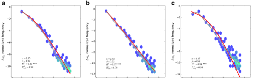
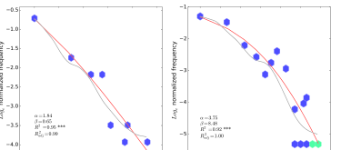

## This module asks how descriptions acquire mathematical form {.statement-slide}

Probability and statistics give us a language for stating what can happen and how often it happens.

## This Module {.compact}

1. **August 31:** What linguistic data can describe
2. **September 2:** Outcomes, events, and probability spaces
3. **September 9:** Joint, conditional, and independent events

## Welcome to Statistical Methods in Linguistics {.section-slide}

August 31

## I am Aaron White

I am an associate professor in Linguistics and Computer Science.

My office is 511A Lattimore Hall. My website is [aaronstevenwhite.io](https://aaronstevenwhite.io/).

::: {.notes}
[Sources]

https://aaronstevenwhite.io/
:::

## My research begins with linguistic representations

I study how words and constructions relate to categories of events, entities, and attitudes.

That work produces corpus annotations, behavioral judgments, and large lexical data sets.

## Those data create statistical questions

1. What exactly did we observe?
2. What larger object or process do the observations tell us about?
3. Which patterns should a statistical model describe?
4. How can we tell whether the model describes those patterns well?

## Why take this course? {.statement-slide}

Probability and statistics is all about describing what happens precisely.

## A speaker articulating a sound is something that happens

We might want to describe how a speaker positioned the tongue and lips while producing a vowel.

The relevant object is the articulatory event itself.

[Random variables and distributions, September 14 to 23](../../random-variables-and-distributions/index.qmd)

## The acoustic signal is also something that happens

We might instead describe the vowel's duration, its first two formants, or how those measurements change through time.

These measurements describe properties of the signal produced by the articulation.

[Statistical inference, September 28 to October 5](../../statistical-inference/index.qmd)

## Reading a sentence is something that happens

We might describe how long a comprehender spent reading a word or a region of a sentence.

The description must allow reading times to vary across readers, words, sentences, and passages.

[Linear regression and prediction, October 7 to 21](../../regression-models/index.qmd)

## Choosing a word or construction is something that happens

A producer might use the double object construction rather than the prepositional dative.

We can describe how that choice varies with properties of the theme, recipient, verb, and discourse context.

[Generalized linear models, November 2 and 4](../../regression-models/why-generalized-linear-models.qmd)

## A rating on a slider is something that happens

A participant might place a slider at an endpoint or somewhere in its interior.

The response format constrains which statistical descriptions can make sense.

[Bounded responses, November 2, 4, 16, and 18](../../regression-models/bounded-responses.qmd)

## The participants and items also matter

Participants may use a scale differently. Sentence items may elicit different responses for reasons we did not manipulate.

We need descriptions that preserve these repeated sources of variation.

[Mixed effects models, November 16 and 18](../../regression-models/fixed-and-random-effects.qmd)

## An experiment determines what can happen in the data

Assignment, counterbalancing, exclusion rules, and the number of observations determine which comparisons the data support.

We therefore study design before treating a model as evidence about a linguistic process.

[Experimental design, November 9 and 11](../../experimental-design/index.qmd)

## A vowel category can be an object of description

Suppose we observe many first and second formant measurements without category labels.

We might ask whether the measurements support a useful grouping into vowel categories.

[Latent structure, November 23](../../latent-structure/index.qmd)

## An entire acceptability lexicon can be an object of description

For each verb, we might ask which syntactic frames permit an acceptable sentence.

The resulting object is not one judgment. It is a structured collection of acceptability values across verbs and frames.

[Factorization, November 30](../../factorization/valex-megaacceptability.qmd)

## Missing measurements change the object we can describe

A typological database may leave some language by feature combinations unobserved.

We need to state what is missing and test whether a proposed completion recovers held out observations.

[Missing data, December 2](../../missing-data/index.qmd)

## An annotation is an event produced by a measurement process

An annotator may answer a question only when an earlier answer opens that question. Annotators may also use scales differently.

A statistical model can describe the annotation process together with the linguistic property being measured.

[Custom model design, December 2](../../custom-models/index.qmd)

## Some objects are not directly observed {.statement-slide}

The thing we want to describe and the data we collect to learn about it need not be identical.

## Consider the acceptability of one verb in one frame

We may observe the verb in that frame in a corpus.

We may also observe a participant judge a sentence containing that verb and frame.

Neither observation is identical to the verb's acceptability in that frame.

## Corpus tokens and judgments provide different evidence

A corpus token tells us that a producer used the form in one context.

A judgment tells us how one participant responded to one sentence under one task.

Both may inform an account of acceptability, but through different processes.

## Data are produced by processes {.statement-slide}

The course describes both the data we collect and the processes that could have produced those data.

## The course develops one question at a time

1. What can happen under the representation?
2. How can a variable describe those possibilities?
3. What does a probability distribution say about the variable?
4. What can a sample tell us about a larger population?
5. How does a model connect a linguistic predictor to a response?
6. How do we check the resulting description?

## Course structure and requirements {.section-slide}

Fall 2026

## We meet on Mondays and Wednesdays

Class meets from **12:30 PM to 1:45 PM** in **Lattimore 513**.

The first meeting is **Monday, August 31**. The final class meeting is **Monday, December 14**.

## The first four weeks build probability descriptions {.compact}

1. **August 31, September 2, and September 9:** linguistic data, probability spaces, and events
2. **September 14 and 16:** random variables and discrete distributions
3. **September 21 and 23:** continuous and joint distributions

## The next four weeks connect samples to predictions {.compact}

1. **September 28 and 30:** populations, samples, and uncertainty
2. **October 5 and 7:** paired inference and linear regression
3. **October 14:** multiple regression and model criticism
4. **October 19 and 21:** prediction, loss, and grouped validation

## October 26 and 28 consolidate the first half

**Monday, October 26** is the review class.

**Wednesday, October 28** is the midterm and the LING 414 proposal deadline.

## November extends the response types and data structures {.compact}

1. **November 2 and 4:** binary, count, and bounded responses
2. **November 9 and 11:** experimental design and generalization
3. **November 16 and 18:** mixed models for ordinal and bounded responses
4. **November 23:** clustering and mixture models
5. **November 30:** factorization

## December moves from existing models to new ones {.compact}

1. **December 2:** missing data and custom model design
2. **December 7, 9, and 14:** LING 414 final project presentations
3. **December 18 to 23:** LING 414 oral assessments

## Three calendar dates do not contain class

1. **Monday, September 7:** Labor Day
2. **Monday, October 12:** Fall Break
3. **Wednesday, November 25:** Thanksgiving recess

## The course is four credits

We meet for two 75 minute sessions each week.

Plan for at least **480 minutes of work outside class each week** for notes, readings, problem sets, and project work.

LING 110 with a grade of C minus or better is the prerequisite.

## The notes carry the main exposition

Each chapter introduces one principal concept and links back to the chapters it requires.

Readings appear in the chapter where they become useful, together with an explanation of what to take from them.

## Three textbooks support the notes {.small}

1. Nicenboim, Schad, and Vasishth, *An Introduction to Bayesian Data Analysis for Cognitive Science*
2. Winter, *Statistics for Linguists: An Introduction Using R*
3. Kruschke, *Doing Bayesian Data Analysis*

The course also uses linguistics papers when their data or arguments bear directly on the method.

## We will work in R

Install **R** and either **RStudio** or **Visual Studio Code**.

Installation instructions and troubleshooting belong on the course Zulip.

## LING 214 has three assessment components {.compact}

| component | weight |
|---|---:|
| five problem sets | 65 percent |
| midterm on October 28 | 25 percent |
| two office hour meetings | 10 percent |

## LING 414 adds an independent final project {.compact}

| component | weight |
|---|---:|
| five problem sets | 40 percent |
| midterm on October 28 | 20 percent |
| final project | 40 percent |

## The five problem sets have fixed due dates {.compact}

1. **Problem Set 1:** October 7, paired vowel measurements
2. **Problem Set 2:** October 21, reading time prediction across passages
3. **Problem Set 3:** November 11, dative construction choice
4. **Problem Set 4:** November 23, discourse commitment judgments
5. **Problem Set 5:** December 7, phonological inventory structure

## Problem sets are part of the course reading

Each problem set develops an analysis that the notes prepare you to understand.

Working through the code and interpreting its output are part of learning the next portion of the course.

## Every problem set has two assessment components

1. Functionality and completeness contribute 50 percent.
2. An in class explanation contributes 50 percent.

Students are selected at random to present and will not know in advance whether they are presenting.

## Be ready to explain every submitted analysis

All students must attend and be prepared to present on any assessment day following a due date.

The assessment concerns what the code does, why the analysis answers the question, and what the result means.

## The LING 414 project unfolds across the semester {.compact}

1. **October 16:** preproposal meeting completed
2. **October 28:** proposal due
3. **December 7, 9, or 14:** presentation
4. **December 14:** paper and code due
5. **December 18 to 23:** code oral assessment

## LING 414 projects can take three forms

1. A corpus analysis
2. An experiment design with an instrument and simulated analysis
3. A mechanistic interpretation of a deep learning model

The final project rubric states the requirements for each option.

## LING 214 participation means meeting with me twice

Office hours are by appointment through the scheduler on my website.

The two meetings may concern course material, a problem set, a possible project, or a statistical question from other work.

## All course communication happens on Zulip {.statement-slide}

Do not use email for course communication.

## Use channels and direct messages differently

Post general questions in the appropriate Zulip channel so that everyone can use the answer.

Use a direct message for grades, absences, accommodations, or other private matters.

## Expect replies during working hours

I generally reply within **one to two business days**.

I do not monitor Zulip after **5 PM** or on weekends.

## Late problem sets lose 10 percent per day

A problem set may be submitted at most three days late.

Project components are not accepted late without prior approval. Ask for an extension at least 48 hours before the deadline, except in an emergency.

## Collaboration is encouraged

You may discuss problem sets with classmates, but each student must write and submit their own solution.

Shared discussion should help you understand the analysis well enough to explain it independently.

## Generative AI may assist with code

You may use generative AI for coding assistance on problem sets and projects.

You must understand the resulting code and cite the tool and the specific prompts in code comments. Generative AI may not be used for written assignments.

## The grading scale is fixed {.tiny}

| A | A minus | B plus | B | B minus | C plus | C | C minus | D plus | D | E |
|---:|---:|---:|---:|---:|---:|---:|---:|---:|---:|---:|
| 93 | 90 | 87 | 83 | 80 | 77 | 73 | 70 | 67 | 60 | below 60 |

## Accommodations begin with Disability Resources

Students seeking accommodations should contact the University Office of Disability Resources.

Faculty are mandatory reporters for Title IX matters. The syllabus links to the relevant confidential and nonconfidential resources.

## What should you do before September 2?

1. Join the Fall 2026 course Zulip.
2. Confirm that you can open the course notes.
3. Begin installing R and your editor.
4. Read the notes on linguistic data and Zipf's law.

## Describing an entire corpus {.section-slide}

Piantadosi 2014 and Zipf's law

## We now return to the central claim {.statement-slide}

Probability and statistics is all about describing what happens precisely.

## A corpus is one very complex thing that happened

A corpus records a large collection of usages produced by many speakers and writers in many contexts.

We can ask for a precise description of that entire collection.

## Begin by counting word types {.small}

| word type | token count | frequency rank |
|---|---:|---:|
| *the* | 10,000 | 1 |
| *of* | 5,100 | 2 |
| *and* | 3,400 | 3 |

The most frequent type receives rank 1.

## Zipf proposed an inverse relation

If $r$ is a word's frequency rank and $f(r)$ is its frequency, then

$$
f(r)\propto\frac{1}{r^\alpha},
$$

where $\alpha$ is often near 1 for word frequencies.

Piantadosi 2014, Equation 1

::: {.notes}
[Sources]

https://doi.org/10.3758/s13423-014-0585-6
:::

## The inverse relation has a simple interpretation

If $\alpha=1$ and the first ranked word occurs 10,000 times, then

$$
f(2)=5{,}000
\qquad\text{and}\qquad
f(3)\approx3{,}333.
$$

Frequency falls as rank rises.

## Mandelbrot allowed the rank to shift

Piantadosi treats the Zipf and Mandelbrot form as the working description:

$$
f(r)\propto\frac{1}{(r+\beta)^\alpha}.
$$

The additional parameter $\beta$ changes the curve among the highest frequency words.

Piantadosi 2014, Equation 2

::: {.notes}
[Sources]

https://doi.org/10.3758/s13423-014-0585-6
:::

## Logarithmic axes make the broad pattern visible

Both rank and frequency range over several orders of magnitude.

A logarithmic axis allocates comparable space to comparable ratios, such as 10 to 100 and 100 to 1,000.

## The American National Corpus is broadly near Zipfian {.figure-slide}

{width="53%" fig-alt="Normalized word frequency plotted against frequency rank for words in the American National Corpus."}

The red curve is the Zipf and Mandelbrot description. The gray curve follows the local average more closely.

Piantadosi 2014, Figure 1a

::: {.notes}
[Sources]

https://doi.org/10.3758/s13423-014-0585-6
:::

## The usual rank frequency plot creates a problem

If rank and frequency are estimated from the same corpus, their measurement errors are related.

Even equally probable word types will receive different observed ranks after chance differences in their counts.

## Piantadosi separates the two measurements

The paper randomly splits the word tokens into two parts.

One part estimates each word's rank. The other estimates its frequency.

This makes deviations from the fitted curve interpretable.

## The broad fit hides systematic departures {.figure-slide}

{width="53%" fig-alt="Difference between observed log word frequency and the Zipf and Mandelbrot curve, plotted against log frequency rank."}

The vertical axis shows the difference between observed log frequency and the curve's prediction.

Piantadosi 2014, Figure 1b

::: {.notes}
[Sources]

https://doi.org/10.3758/s13423-014-0585-6
:::

## The departures are not random noise

The differences form long runs above and below zero, including a large scoop among lower frequency words.

Even the highest frequency words show systematic local structure that the simple curve does not describe.

## Two claims are true at once {.statement-slide}

The large scale pattern is near Zipfian, and the full word frequency distribution is substantially more complex.

## The paper asks what an explanation must account for

Deriving a power law is not enough because many incompatible processes can yield a similar curve.

Piantadosi therefore examines additional properties of word frequencies that distinguish possible explanations.

## Meaning predicts frequency across languages {.figure-slide}

{width="47%" fig-alt="Frequency rank plots for Swadesh list meanings across 17 languages."}

The common rank ordering is estimated across languages. Similar meanings tend to occupy similar portions of the frequency distribution.

Piantadosi 2014, Figure 2

::: {.notes}
[Sources]

https://doi.org/10.3758/s13423-014-0585-6
:::

## Number word meanings predict their frequencies {.figure-slide}

{width="86%" fig-alt="Frequency of number words plotted against cardinality in English, Russian, and Italian."}

The horizontal axis is cardinality rather than an independently assigned rank. Smaller numbers receive higher frequencies across English, Russian, and Italian.

Piantadosi 2014, Figure 3

::: {.notes}
[Sources]

https://doi.org/10.3758/s13423-014-0585-6
:::

## Shared reference does not remove the pattern {.figure-slide}

{width="76%" fig-alt="Frequency distributions for taboo words referring to sexual activity and feces."}

Taboo words with roughly shared referential content still show highly unequal frequencies.

Social register and other aspects of use may therefore matter alongside reference.

Piantadosi 2014, Figure 4

::: {.notes}
[Sources]

https://doi.org/10.3758/s13423-014-0585-6
:::

## Naturally constrained categories remain near Zipfian {.figure-slide}

{width="88%" fig-alt="Frequency distributions for names of months, planets, and chemical elements."}

Months, planets, and elements give a language relatively little freedom to choose the relevant referents.

Piantadosi 2014, Figure 5

::: {.notes}
[Sources]

https://doi.org/10.3758/s13423-014-0585-6
:::

## The pattern is not restricted to word types {.figure-slide}

{width="43%" fig-alt="Frequency distribution of syntactic categories in the Penn Treebank."}

Syntactic category frequencies in the Penn Treebank also form a strongly unequal distribution.

Piantadosi 2014, Figure 6

::: {.notes}
[Sources]

https://doi.org/10.3758/s13423-014-0585-6
:::

## Different syntactic categories have different shapes {.figure-slide}

{width="73%" fig-alt="Frequency distributions within six Penn Treebank syntactic categories."}

Determiners, prepositions, modals, nouns, and two verb categories differ in their fitted curves and in their systematic departures from those curves.

Piantadosi 2014, Figure 7

::: {.notes}
[Sources]

https://doi.org/10.3758/s13423-014-0585-6
:::

## Word frequency changes with context and time

The probability of using *Dallas* differs between a discussion of Lyndon Johnson and a discussion of Carl Sagan.

Topics, social groups, technologies, and historical events all change word frequencies.

## A corpus frequency averages over contexts {.statement-slide}

The simple rank frequency curve describes an aggregate whose components need not follow one unchanging distribution.

## Novel names also show unequal use {.figure-slide}

{width="40%" fig-alt="Average frequency distribution for eight novel alien names used in a story production experiment."}

Twenty five participants wrote stories of at least 2,000 words using eight novel alien names. The participant average was near Zipfian.

Piantadosi 2014, Figure 8

::: {.notes}
[Sources]

https://doi.org/10.3758/s13423-014-0585-6
:::

## The novel name result has a stated limit

The paper combines participants after ordering each participant's names by frequency.

Larger studies would be needed to establish the pattern reliably within individual participants.

## Similar patterns occur outside language

Piantadosi reviews near Zipfian frequency distributions in music, computer programs, and internet systems.

This breadth could reflect a general process, or different processes could produce similar aggregate descriptions.

## Random typing reproduces the broad curve

A process that emits characters independently and occasionally emits a space can produce a near Zipfian distribution of resulting strings.

Humans do not produce words by emitting independent characters until a space happens to occur.

## Even a false word boundary preserves the pattern {.figure-slide}

{width="43%" fig-alt="Frequency distribution of strings created by treating the letter e as a word boundary in the American National Corpus."}

Treating the letter *e* as a boundary in the American National Corpus still produces a near Zipfian curve.

Piantadosi 2014, Figure 9

::: {.notes}
[Sources]

https://doi.org/10.3758/s13423-014-0585-6
:::

## Reproducing the curve does not validate the process {.statement-slide}

A model can describe the aggregate pattern while misdescribing how speakers produce words.

## Preferential reuse supplies another possible process

If a word becomes more likely to recur after it has already occurred, a strongly unequal frequency distribution can develop.

But discourse topic may explain both the earlier use and the later reuse. Reuse itself need not be the underlying cause.

## Semantic organization explains only part of the evidence

Meaning strongly predicts frequency, so an account of word frequency must represent meaning.

But meanings constrained by nature and newly introduced names also produce near Zipfian patterns. Semantic organization alone is therefore incomplete.

## Communicative optimization requires independent evidence

Optimization models can yield Zipfian frequencies by balancing assumptions about speaker and listener costs.

The paper argues that the psychological assumptions and the required parameter values must be tested independently of the resulting curve.

## Universal accounts need predictions that could fail

General arguments from information, computation, or entropy may explain why power laws occur in many systems.

Without new predictions, the observed curve cannot distinguish these accounts from more specific psychological processes.

## Memory is a possible direction, not a result

The novel name experiment suggests that memory may contribute to unequal reuse even without an established lexicon.

Piantadosi presents this as a possibility that requires a fuller model and new evidence.

## A useful explanation must do more than fit

1. State a process that could plausibly produce the data
2. Test the assumptions of that process independently
3. Predict observations beyond the rank frequency curve
4. Account for meaning, category, context, time, and novel production

## Zipf's law shows how broad “what happens” can be

The object being described is an entire corpus of usages, compressed into a relation between word type frequency and frequency rank.

The processes that produce that object include individual choices made across speakers, contexts, and historical periods.

## Statistical work separates two questions {.statement-slide}

What pattern does the data exhibit, and which process could have produced that pattern?

## The course returns to this distinction

1. **October 14:** model criticism asks where a fitted description fails.
2. **October 19 and 21:** prediction asks whether the description extends to new data.
3. **November 30:** factorization describes structured lexical objects.
4. **December 2:** custom model design states processes that could produce complex annotations.

## What we established on August 31

1. Linguistic data record many different kinds of happenings.
2. The object of interest may be more abstract than an observed response.
3. A statistical model can describe an aggregate pattern or a process that produces data.
4. Matching one broad pattern does not by itself identify the process.

## Read before September 2

[Turning linguistic records into data](../../foundations/linguistic-data.qmd)

[Zipf's law](../../foundations/zipfs-law.qmd)

## Outcomes, events, and probability spaces {.section-slide}

September 2

## Begin from the preceding meeting

We first chose what one observation represents.

We now state what can happen to one represented observation and which distinctions receive probabilities.

## What does a probability measure? {.statement-slide}

A probability is a measurement of a possibility relative to a range of possibilities.

## Start with the possible outcomes

Suppose one observation is one represented English personal pronoun token.

Which forms can the model produce as outcomes?

## A sample space lists the outcomes {.compact}

$$
\Omega=\{\textit{I},\textit{me},\textit{you},\textit{he},\textit{him},
\textit{she},\textit{her},\textit{we},\textit{us},\textit{they},\textit{them}\}
$$

The [**sample space**](https://bruno.nicenboim.me/bayescogsci/ch-intro.html) is the set of possible [**outcomes**](https://bruno.nicenboim.me/bayescogsci/ch-intro.html) under the declared representation.

::: {.notes}
[Sources]

https://bruno.nicenboim.me/bayescogsci/ch-intro.html
:::

## The sample space belongs to a representation

$\textit{herself}\notin\Omega$ says that the current model omits *herself*.

It does not say that speakers cannot produce *herself*.

## Granularity changes the outcome {.small}

| represented unit | one possible outcome |
|---|---|
| vowel category | /i/ |
| vowel token | one production of /i/ |
| acoustic measurement | an F1 value |
| acoustic trajectory | a sequence of F1 values |

## Check the sample space

A vowel study asks whether formant trajectories differ by dialect.

Should one outcome be a vowel category, one F1 value, or a complete trajectory?

## Events turn questions into sets {.section-slide}

Which outcomes answer the question in the same way?

## Ask whether the pronoun is third person

Several outcomes give the same answer.

The forms *he*, *her*, and *them* are distinct outcomes, but each is third person.

## An event is a set of outcomes

An [**event**](https://bruno.nicenboim.me/bayescogsci/ch-intro.html) groups outcomes that make a proposition true.

$$
T=\{\textit{he},\textit{him},\textit{she},\textit{her},\textit{they},\textit{them}\}
$$

::: {.notes}
[Sources]

https://bruno.nicenboim.me/bayescogsci/ch-intro.html
:::

## One outcome can belong to several events

Let $A$ be the event that the pronoun is accusative.

The outcome *them* belongs to both $T$ and $A$.

It is still one outcome.

## Set operations express linguistic combinations

1. $B\cap C$ represents “$B$ and $C$.”
2. $B\cup C$ represents inclusive “$B$ or $C$.”
3. $B^c$ represents “not $B$,” relative to $\Omega$.

## Work through an intersection

If $T$ is third person and $A$ is accusative, then

$$
T\cap A=\{\textit{him},\textit{her},\textit{them}\}.
$$

## Two events are always available

The entire sample space $\Omega$ is the event that some represented outcome occurs.

The empty set $\varnothing$ is the event that no represented outcome occurs.

## Check the event

Let $P$ be plural and $A$ be accusative.

Write $P\cap A$, $P\cup A$, and $P^c$ for the four outcome pronoun space $\{\textit{he},\textit{him},\textit{they},\textit{them}\}$.

## Which events can receive probabilities? {.section-slide}

Sigma-algebras

## A model need not measure every imaginable set

Suppose the model records plural number but not case.

It can distinguish plural from nonplural forms without distinguishing *they* from *them*.

## A sigma-algebra states what is measurable

A [**sigma-algebra**](https://stats.libretexts.org/Bookshelves/Probability_Theory/Probability_Mathematical_Statistics_and_Stochastic_Processes_%28Siegrist%29/01%3A_Foundations/1.11%3A_Measurable_Spaces) is the collection of events to which a probability model assigns probabilities.

We will write this collection as $\mathcal F$.

::: {.notes}
[Sources]

https://stats.libretexts.org/Bookshelves/Probability_Theory/Probability_Mathematical_Statistics_and_Stochastic_Processes_%28Siegrist%29/01%3A_Foundations/1.11%3A_Measurable_Spaces
:::

## Requirement 1: include the full space

$$
\Omega\in\mathcal F
$$

The model must be able to measure the event that some represented outcome occurs.

## Requirement 2: include complements

If $B\in\mathcal F$, then

$$
B^c\in\mathcal F.
$$

Measuring “plural” requires measuring “not plural.”

## Requirement 3: include countable unions

If $B_1,B_2,\ldots\in\mathcal F$, then

$$
\bigcup_i B_i\in\mathcal F.
$$

Measurable alternatives remain measurable when combined.

## A minimal sigma-algebra for plurality

For plural $P$ in $\Omega_4=\{\textit{he},\textit{him},\textit{they},\textit{them}\}$,

$$
\mathcal F_P=\{\varnothing,P,P^c,\Omega_4\}.
$$

## Work through a failed collection

The collection $\{\Omega_4,P\}$ is not a sigma-algebra.

It omits $P^c$ and $\varnothing$.

## What the sigma-algebra means

$\Omega$ states which outcomes exist in the representation.

$\mathcal F$ states which groupings of those outcomes can receive probabilities.

## Check measurability

If the event “accusative” is not in $\mathcal F_P$, can the model assign a probability to accusative form?

What additional distinction must the event space retain?

## Generate the required event space {.section-slide}

Begin from the distinctions the question needs

## Measure plurality and case

Let $P$ be plural and $A$ be accusative.

We want the smallest sigma-algebra that contains both events.

## A generating set specifies the distinctions

The collection $\{P,A\}$ is a [**generating set**](https://stats.libretexts.org/Bookshelves/Probability_Theory/Probability_Mathematical_Statistics_and_Stochastic_Processes_%28Siegrist%29/01%3A_Foundations/1.11%3A_Measurable_Spaces).

$\sigma(P,A)$ is the smallest sigma-algebra containing both events.

::: {.notes}
[Sources]

https://stats.libretexts.org/Bookshelves/Probability_Theory/Probability_Mathematical_Statistics_and_Stochastic_Processes_%28Siegrist%29/01%3A_Foundations/1.11%3A_Measurable_Spaces
:::

## Cross the two distinctions

Each outcome must fall into one combination of plural or nonplural and accusative or nonaccusative.

These smallest nonempty intersections are the [**atoms**](https://stats.libretexts.org/Bookshelves/Probability_Theory/Probability_Mathematical_Statistics_and_Stochastic_Processes_%28Siegrist%29/01%3A_Foundations/1.11%3A_Measurable_Spaces).

::: {.notes}
[Sources]

https://stats.libretexts.org/Bookshelves/Probability_Theory/Probability_Mathematical_Statistics_and_Stochastic_Processes_%28Siegrist%29/01%3A_Foundations/1.11%3A_Measurable_Spaces
:::

## Find the atoms {.compact}

$$
P\cap A=\{\textit{them}\},\qquad P\cap A^c=\{\textit{they}\},
$$

$$
P^c\cap A=\{\textit{him}\},\qquad P^c\cap A^c=\{\textit{he}\}.
$$

## The atoms determine every measurable event

Every atom is a singleton in this four outcome space.

Every subset is therefore a union of atoms, so

$$
\sigma(P,A)=2^{\Omega_4}.
$$

## A coarser generator leaves distinctions hidden

Generating from $P$ alone cannot distinguish *they* from *them*.

More observations do not repair a distinction omitted by the representation.

## Assign probabilities to events {.section-slide}

Probability measures

## Begin with mass on the outcomes {.small}

| outcome | probability |
|---|---:|
| *he* | $.20$ |
| *him* | $.30$ |
| *they* | $.10$ |
| *them* | $.40$ |

## A probability measure assigns numerical mass

A [**probability measure**](https://stats.libretexts.org/Bookshelves/Probability_Theory/Probability_Mathematical_Statistics_and_Stochastic_Processes_%28Siegrist%29/02%3A_Probability_Spaces/2.09%3A_Probability_Spaces_Revisited) maps measurable events to numbers.

$$
\mathbb P:\mathcal F\rightarrow[0,1]
$$

::: {.notes}
[Sources]

https://stats.libretexts.org/Bookshelves/Probability_Theory/Probability_Mathematical_Statistics_and_Stochastic_Processes_%28Siegrist%29/02%3A_Probability_Spaces/2.09%3A_Probability_Spaces_Revisited
:::

## The probability space has three parts

The triple

$$
\langle\Omega,\mathcal F,\mathbb P\rangle
$$

is a [**probability space**](https://bruno.nicenboim.me/bayescogsci/ch-intro.html).

::: {.notes}
[Sources]

https://bruno.nicenboim.me/bayescogsci/ch-intro.html
:::

## Requirement 1: probabilities are nonnegative

For every $B\in\mathcal F$,

$$
\mathbb P(B)\geq0.
$$

## Requirement 2: total probability is one

$$
\mathbb P(\Omega)=1.
$$

The represented possibilities exhaust the probability mass.

## Requirement 3: disjoint probabilities add

For pairwise disjoint events $B_1,B_2,\ldots$,

$$
\mathbb P\left(\bigcup_i B_i\right)=\sum_i\mathbb P(B_i).
$$

## Compute one event probability

For $A=\{\textit{him},\textit{them}\}$,

$$
\mathbb P(A)=.30+.40=.70.
$$

## Check the total mass

Four exhaustive outcomes receive probabilities $.40$, $.35$, $.20$, and $.10$.

Can these values define a probability measure? Which requirement fails?

## What we decided on September 2

1. $\Omega$ states the represented outcomes.
2. Events translate linguistic questions into sets.
3. $\mathcal F$ states which events are measurable.
4. $\mathbb P$ assigns coherent mass to those events.

## Read the probability space notes

[Sample spaces](../../foundations/possibilities-and-events.qmd)

[Events](../../foundations/events.qmd)

[Sigma-algebras](../../foundations/event-spaces.qmd)

[Probability measures](../../foundations/probability-measures.qmd)

## Joint, conditional, and independent events {.section-slide}

September 9

## Return to the four outcome measure {.small}

| outcome | number | case | probability |
|---|---|---|---:|
| *he* | singular | nominative | $.20$ |
| *him* | singular | accusative | $.30$ |
| *they* | plural | nominative | $.10$ |
| *them* | plural | accusative | $.40$ |

## When can probabilities be added directly? {.section-slide}

Mutual exclusivity

## Some events cannot occur together

One pronoun outcome cannot be both nominative and accusative in this representation.

The two events have no outcomes in common.

## Mutually exclusive events have an empty intersection

Events $B$ and $C$ are [**mutually exclusive**](https://bruno.nicenboim.me/bayescogsci/ch-intro.html) when

$$
B\cap C=\varnothing.
$$

::: {.notes}
[Sources]

https://bruno.nicenboim.me/bayescogsci/ch-intro.html
:::

## Disjoint event probabilities add

If $B\cap C=\varnothing$, then

$$
\mathbb P(B\cup C)=\mathbb P(B)+\mathbb P(C).
$$

## Overlap must be subtracted once

For events that can occur together,

$$
\mathbb P(B\cup C)
=\mathbb P(B)+\mathbb P(C)-\mathbb P(B\cap C).
$$

## Labels do not determine exclusivity

“Plural” and “accusative” are different labels, but *them* belongs to both events.

The represented outcomes determine whether the intersection is empty.

## Measure two properties together {.section-slide}

Joint probability

## The joint event is an intersection

The [**joint probability**](https://bruno.nicenboim.me/bayescogsci/ch-intro.html) of $P$ and $A$ is

$$
\mathbb P(P\cap A).
$$

::: {.notes}
[Sources]

https://bruno.nicenboim.me/bayescogsci/ch-intro.html
:::

## Compute the joint probability

The event $P\cap A$ contains only *them*.

Thus

$$
\mathbb P(P\cap A)=.40.
$$

## Arrange the joint probabilities in a table {.small}

| | accusative $A$ | nominative $A^c$ | total |
|---|---:|---:|---:|
| plural $P$ | $.40$ | $.10$ | $.50$ |
| singular $P^c$ | $.30$ | $.20$ | $.50$ |
| total | $.70$ | $.30$ | $1$ |

## Marginal probabilities sum over the other distinction

[**Marginal probabilities**](https://bruno.nicenboim.me/bayescogsci/ch-intro.html) appear in the table margins.

$$
\mathbb P(P)=.40+.10=.50
$$

::: {.notes}
[Sources]

https://bruno.nicenboim.me/bayescogsci/ch-intro.html
:::

## Restrict the reference event {.section-slide}

Conditional probability

## Ask a within event question

Among plural pronouns, how much of the probability belongs to accusative forms?

The phrase “among plural pronouns” makes $P$ the reference event.

## Rescale within the plural event {.small}

| plural outcome | probability in $\Omega_4$ | probability within $P$ |
|---|---:|---:|
| *they* | $.10$ | $.10/.50=.20$ |
| *them* | $.40$ | $.40/.50=.80$ |

## Conditional probability divides part by whole

The [**conditional probability**](https://bruno.nicenboim.me/bayescogsci/ch-intro.html) of $A$ given $P$ is

$$
\mathbb P(A\mid P)=\frac{\mathbb P(A\cap P)}{\mathbb P(P)}.
$$

::: {.notes}
[Sources]

https://bruno.nicenboim.me/bayescogsci/ch-intro.html
:::

## Compute the conditional probability

$$
\begin{aligned}
\mathbb P(A\mid P)
&=\frac{.40}{.50}\\
&=.80.
\end{aligned}
$$

## Reversing the condition changes the denominator

$$
\mathbb P(P\mid A)=\frac{.40}{.70}\approx.57.
$$

The overlap stays the same. The reference event changes.

## Read the condition first

For $\mathbb P(A\mid P)$,

1. restrict attention to $P$,
2. then ask what portion also belongs to $A$.

## Do not transpose a conditional probability

Most passive clauses may have animate subjects.

It does not follow that most clauses with animate subjects are passive.

## Recover the joint probability {.section-slide}

The product rule

## Rearrange the conditional probability definition

Starting from

$$
\mathbb P(A\mid P)=\frac{\mathbb P(A\cap P)}{\mathbb P(P)},
$$

multiply both sides by $\mathbb P(P)$.

## The product rule

The [**product rule**](https://bruno.nicenboim.me/bayescogsci/ch-intro.html) gives

$$
\mathbb P(A\cap P)=\mathbb P(A\mid P)\mathbb P(P).
$$

::: {.notes}
[Sources]

https://bruno.nicenboim.me/bayescogsci/ch-intro.html
:::

## Interpret the product with 100 tokens

1. Fifty of 100 tokens are plural.
2. Forty of those 50 plural tokens are accusative.
3. Thus 40 of 100 tokens are both plural and accusative.

## Compute the product

$$
\begin{aligned}
\mathbb P(A\cap P)
&=.80\times.50\\
&=.40.
\end{aligned}
$$

## Reverse the factor order

The same intersection can be written

$$
\mathbb P(A\cap P)=\mathbb P(P\mid A)\mathbb P(A).
$$

Both products recover $.40$.

## A product does not assert independence {.statement-slide}

The product rule contains a conditional probability. It allows the events to be associated.

## Reverse a conditional probability {.section-slide}

Bayes' rule

## Equate two products for the same intersection

$$
\mathbb P(B\mid C)\mathbb P(C)
=\mathbb P(C\mid B)\mathbb P(B).
$$

Both sides equal $\mathbb P(B\cap C)$.

## Bayes' rule

[**Bayes' rule**](https://bruno.nicenboim.me/bayescogsci/ch-intro.html) solves the equality for one conditional probability.

$$
\mathbb P(B\mid C)
=\frac{\mathbb P(C\mid B)\mathbb P(B)}{\mathbb P(C)}.
$$

::: {.notes}
[Sources]

https://bruno.nicenboim.me/bayescogsci/ch-intro.html
:::

## A dialect feature example {.small}

| | feature $F$ | no feature $F^c$ | total |
|---|---:|---:|---:|
| dialect group $D$ | 90 | 10 | 100 |
| other group $D^c$ | 180 | 720 | 900 |
| total | 270 | 730 | 1,000 |

## The feature is common within the dialect group

$$
\mathbb P(F\mid D)=\frac{90}{100}=.90.
$$

This conditions on membership in the dialect group.

## Group membership is less common among feature tokens

$$
\mathbb P(D\mid F)=\frac{90}{270}=\frac13.
$$

This conditions on observing the feature.

## Bayes' rule retains prevalence

$$
\mathbb P(D\mid F)
=\frac{\mathbb P(F\mid D)\mathbb P(D)}{\mathbb P(F)}
=\frac{.90\times.10}{.27}
=\frac13.
$$

## Ask whether conditioning changes probability {.section-slide}

Independence

## Compare the joint probability with the product of margins

Events $B$ and $C$ are [**independent**](https://bruno.nicenboim.me/bayescogsci/ch-intro.html) when

$$
\mathbb P(B\cap C)=\mathbb P(B)\mathbb P(C).
$$

::: {.notes}
[Sources]

https://bruno.nicenboim.me/bayescogsci/ch-intro.html
:::

## The pronoun events are not independent

$$
\mathbb P(P)\mathbb P(A)=.50\times.70=.35
$$

but

$$
\mathbb P(P\cap A)=.40.
$$

## Independence also has a conditional form

When $\mathbb P(C)>0$, independence implies

$$
\mathbb P(B\mid C)=\mathbb P(B).
$$

Learning that $C$ occurred does not change the probability of $B$.

## Rearrange the mass to make the events independent {.small}

| | accusative $A$ | nominative $A^c$ | total |
|---|---:|---:|---:|
| plural $P$ | $.35$ | $.15$ | $.50$ |
| singular $P^c$ | $.35$ | $.15$ | $.50$ |
| total | $.70$ | $.30$ | $1$ |

## Independence belongs to the probability measure

The event labels are unchanged across the two tables.

The arrangement of probability mass determines whether the events are independent.

## Independence is not mutual exclusivity

Mutually exclusive events with positive probability cannot be independent.

Observing one event rules out the other.

## Check the distinction

Explain why

1. $\mathbb P(B\cap C)=0$ expresses mutual exclusivity, while
2. $\mathbb P(B\cap C)=\mathbb P(B)\mathbb P(C)$ expresses independence.

## Module summary {.section-slide}

From records to probability spaces

## What a probability statement requires {.compact}

1. A unit that states what one observation represents
2. A sample space that states the possible outcomes
3. Events that express the linguistic distinctions of interest
4. A sigma-algebra that states which events are measurable
5. A probability measure that assigns coherent mass

## Three calculations answer three questions

1. $\mathbb P(B\cap C)$ asks how much mass belongs to both events.
2. $\mathbb P(B\mid C)$ asks how much of event $C$ also belongs to $B$.
3. Independence asks whether conditioning on $C$ changes the probability of $B$.

## Return to the question for the module {.statement-slide}

A probability model can describe only the distinctions retained by the data representation and declared by its probability space.

## Continue in the notes

[From linguistic records to probabilities](../../foundations/index.qmd)
