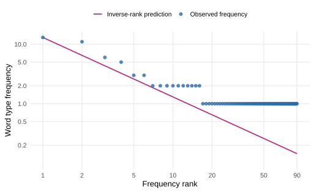
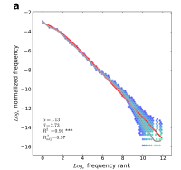

<!-- notes-page: foundations/index.qmd -->

## One utterance, several possible datasets {.section-slide}

One production of *heed* may yield one recording, one word token, one vowel token, or several acoustic measurements.

The analysis begins by deciding which object counts as one observation.

## The representation problem

The **representation problem** is the need to decide what one row represents and which differences among speakers, items, and tokens remain visible.

## Linguistic data and comparisons {.compact}

1. turn stored records into observations;
2. turn a research question into a comparison;
3. distinguish description from process explanation.

## Probability

$$
\langle\Omega,\mathcal F,\mathbb P\rangle
$$

$\Omega$ represents possible outcomes, $\mathcal F$ represents measurable events, and $\mathbb P$ assigns their probabilities.

## From observations to probability measures {.compact}

1. unit of observation and observation key
2. linguistic comparison and estimand
3. possible outcomes
4. measurable events
5. probability measure

Each page introduces one object used by the next.

## Representation precedes probability

Probability does not decide whether an observation is a file, token, type, or measurement.

That representation is fixed before probabilities are assigned.

## More data cannot repair the wrong observation

A numerical result cannot repair a mismatch between the represented observation and the linguistic claim.

More data of the wrong kind remain data of the wrong kind.

## Fix the represented observation {.statement-slide}

Finish the sentence: **one observation represents ...**

Next: identify the [unit of observation and observation key](../../foundations/linguistic-data.html).

<!-- notes-page: foundations/linguistic-data.qmd -->

## A recording is not yet an observation

A recording of *heed* contains a word token, a vowel token, and a sequence of acoustic measurements.

Which one does a row represent?

::: {.notes}
[Sources]

https://fon.hum.uva.nl/praat/manual/Formant.html
:::

## Unit of observation and observation key

The **unit of observation** is the entity or event represented by one row.

The decision that fixes this representation is the **unit choice**.

We reserve **unit of analysis** for the smallest unit treated as independent or carried into the intended generalization.

We call the smallest collection of columns that uniquely identifies that observation its **observation key**.

::: {.notes}
[Sources]

https://bookdown.org/pkaldunn/Book/UnitsObsAnalysis.html

https://datacarpentry.github.io/spreadsheet-ecology-lesson/01-format-data.html
:::

## The stored record

A **record** is a stored artifact: a recording, corpus document, response log, or annotation file.

One record may contain many observations; several records may contribute to one observation.

## One reading-time observation

> One observation represents one participant's reading of one region in one sentence.

Its observation key is

$$
\langle\text{participant},\text{sentence},\text{region}\rangle.
$$

## What aggregation removes {.small}

| one row represents | variation still visible |
|---|---|
| participant, sentence, region | participants, sentences, regions |
| participant, sentence | participants, sentences |
| sentence mean | sentences |

## Tokens and types

A **token** is an occurrence in context. A **type** groups tokens treated as equivalent.

Ten occurrences of *runs* are ten tokens of one word-form type; a lemma analysis may group them with *run*, *ran*, and *running*.

::: {.notes}
[Sources]

https://web.stanford.edu/~jurafsky/slp3/old_aug25/ed3book.pdf
:::

## A unique row is not an independent row

Two rows may have distinct keys and still share a participant, sentence, speaker, word, or language.

Uniqueness identifies observations; it does not establish independence.

## Measurement, analysis, and generalization

1. Where was the response measured?
2. What does one analyzed response represent?
3. Which speakers or items should the claim generalize to?

One thousand tokens from one speaker do not represent variation across speakers.

## A pre-analysis specification

> One observation represents one attested dative construction token. Its key combines document and token position. Speakers, verbs, and documents repeat.

Specify the unit, key, repeated identifiers, removed variation, and replication before modeling.

## Check the observation key {.statement-slide}

For a token analysis, can two rows share the proposed observation key?

Next: state the [comparison that answers the linguistic question](../../foundations/making-sense-of-data.html).

<!-- notes-page: foundations/making-sense-of-data.qmd -->

## An illustrative difference is not yet a linguistic result

| condition | average reading time |
|---|---:|
| noncoercing control | 410 ms |
| coercion condition | 455 ms |

These teaching values are hypothetical rather than reported results.

What comparison does the 45 ms difference estimate?

$$
455\ \mathrm{ms}-410\ \mathrm{ms}=45\ \mathrm{ms}.
$$

::: {.notes}
[Sources]

https://pubmed.ncbi.nlm.nih.gov/10380662/

https://pubmed.ncbi.nlm.nih.gov/11062325/
:::

## The comparison-alignment problem

The **comparison-alignment problem** is the gap between a numerical difference and the claim it is meant to support.

Alignment requires a unit, response, predictor, comparison, and estimand.

## Step 1: identify the response

The **response** is total self-paced reading time, in milliseconds, over the predefined complement-plus-spillover region on one participant-by-sentence trial.

## Step 2: identify the linguistic contrast

The main **predictor** distinguishes coercion from noncoercing control trials.

If the conditions use different verb sets, it does not isolate coercion.

## Step 3: identify the compared observations

Compare conditions within participants and within sentence items.

Different participant groups or item sets introduce additional differences.

## Step 4: state the estimand

Let $\mu_{\mathrm{coercion}}$ and $\mu_{\mathrm{control}}$ be target-population mean reading times.

$$
\tau
\equiv
\mu_{\mathrm{coercion}}
-
\mu_{\mathrm{control}}.
$$

::: {.notes}
[Sources]

https://database.ich.org/sites/default/files/E9-R1_Step4_Guideline_2019_1203.pdf
:::

## The complete analysis specification

> One observation is one participant-by-sentence reading of the declared region; the comparison is within participants and items; the target is $\tau$.

## The same records can answer different questions

The same trials may support analyses of reading time, interpretation choice, or associations between participant-level contrasts.

These are different estimands.

## Three alignment failures {.compact}

1. One speaker's tokens cannot estimate variation among speakers.
2. Different verb sets do not isolate coercion.
3. Trials from observed readers do not test transfer to new readers.

Changing the estimator repairs none of these failures.

## Exploration can change the question

If slider responses pile up at the endpoints, a target concerned only with mean position may omit the endpoint-versus-interior distinction.

Revise and report the estimand explicitly.

## Check the comparison alignment {.statement-slide}

Does the response, predictor, comparison, and estimand refer to the same unit and population?

Next: apply the sequence to [word frequency and rank](../../foundations/zipfs-law.html).

<!-- notes-page: foundations/zipfs-law.qmd -->

## Count occurrences or groups?

Washington's 1793 address contains 135 represented word tokens assigned to 90 orthographic word-form types.

Frequency counts tokens; rank orders types.

::: {.notes}
[Sources]

https://quanteda.io/reference/data_corpus_inaugural.html
:::

## Zipf's law

**Zipf's law** names an approximate inverse relation between a represented type's frequency and its frequency rank.

::: {.notes}
[Sources]

https://doi.org/10.3758/s13423-014-0585-6
:::

## Observed value, prediction, residual

$$
f(r)\equiv\text{token count at rank }r,
$$

$$
\widehat f(r)\equiv Cr^{-\alpha},
\qquad C>0,\ \alpha>0,
\qquad
e(r)\equiv f(r)-\widehat f(r).
$$

## Count the tokens {.small}

| type | *the* | *of* | *I* | *to* | *in* | *shall* |
|---|---:|---:|---:|---:|---:|---:|
| count | 13 | 11 | 6 | 5 | 3 | 3 |

Ties are ordered alphabetically so that the ranks are reproducible.

## The counting representation

State what counts as a token, a type, and the corpus; then state the tie rule.

Lemmatizing *run*, *runs*, *ran*, and *running* changes counts and ranks.

## Compare counts with the inverse pattern {.small}

Fix $\alpha=1$ and anchor the curve at rank 1, so $C=f(1)=13$.

| $r$ | $f(r)$ | $\widehat f(r)=13/r$ | $e(r)$ |
|---:|---:|---:|---:|
| 1 | 13 | 13.00 | 0.00 |
| 2 | 11 | 6.50 | 4.50 |
| 3 | 6 | 4.33 | 1.67 |

We do not estimate $\alpha$ or compare explanations of the rank-frequency relation.

## The represented counts and inverse prediction {.figure-slide}

{width="66%" fig-alt="Word frequency by frequency rank for Washington's 1793 inaugural address, with the inverse-rank prediction shown as a line."}

The points are observed type counts; the line is $13/r$.

## Inspect the broad pattern {.figure-slide}

{width="54%" fig-alt="Normalized word frequency plotted against frequency rank."}

A fitted curve describes the rank-frequency relation in the represented corpus.

Piantadosi 2014, Figure 1a

::: {.notes}
[Sources]

https://doi.org/10.3758/s13423-014-0585-6
:::

## Inspect the departures from the curve {.figure-slide}

{width="54%" fig-alt="Observed deviations from a simple Zipfian rank-frequency curve."}

The departures are systematic, especially among very frequent and very infrequent types.

Piantadosi 2014, Figure 1b

::: {.notes}
[Sources]

https://doi.org/10.3758/s13423-014-0585-6
:::

## The description-explanation gap

Does an inverse rank-frequency curve describe the broad pattern?

What process produced the particular frequencies and deviations in this corpus?

## The descriptive target

One observation represents one word-form type; its response is token count; rank follows from sorting under the declared tie rule.

A fitted curve does not explain lexical choice, memory, or communication.

## Declare tokens, types, corpus, and rank ties {.statement-slide}

Which choices define the tokens, types, corpus, and tie ordering?

Next: declare the [possible outcomes](../../foundations/possibilities-and-events.html).

<!-- notes-page: foundations/possibilities-and-events.qmd -->

## Which result does the model represent?

One pronoun token may be represented by its recording, surface form, or annotated form.

The probability model must choose one.

## The outcome-representation problem

The **outcome-representation problem** is the need to decide which possible results are members of the model's sample space.

## Outcome and sample space

An **outcome** is one possible represented result. The **sample space** is the set of all outcomes:

$$
\Omega\equiv
\{\textit{I},\textit{me},\textit{you},\textit{it},\textit{he},\textit{him},
\textit{she},\textit{her},\textit{we},\textit{us},\textit{they},\textit{them}\}.
$$

::: {.notes}
[Sources]

https://bruno.nicenboim.me/bayescogsci/ch-intro.html
:::

## Membership and a trial record

$$
\textit{him}\in\Omega,
\qquad
\textit{herself}\notin\Omega.
$$

A response-retaining outcome may instead be

$$
\langle\text{participant and sentence trial},6\rangle.
$$

## Outcome granularity fixes the available distinctions

Outcome granularity determines which distinctions remain available: recording, vowel token, time point, response value, or identified trial.

## Omission is not impossibility

If skipping is recordable, then

$$
\{\text{agent},\text{patient}\}
$$

omits a possible result. The omission does not make skipping impossible.

## Check the modeled outcomes {.statement-slide}

Does $\textit{herself}\notin\Omega$ describe English, or only this model?

Next: group outcomes into [events](../../foundations/events.html).

<!-- notes-page: foundations/events.qmd -->

## Linguistic questions group outcomes

Was the selected pronoun third person? Was it nominative? Was it accusative?

Each yes-or-no question collects the outcomes that make it true.

## Event

An **event** is a subset of $\Omega$. Once $\mathcal F$ is specified, its members are the measurable events.

::: {.notes}
[Sources]

https://bruno.nicenboim.me/bayescogsci/ch-intro.html
:::

## Person and case in the 12-form space {.small}

$$
T_{12}\equiv\{\textit{they},\textit{them},\textit{it},\textit{she},
\textit{her},\textit{he},\textit{him}\},
$$

$$
\begin{aligned}
A_{12}&\equiv\{\textit{me},\textit{you},\textit{them},\textit{her},
\textit{him},\textit{it},\textit{us}\},\\
N_{12}&\equiv\{\textit{I},\textit{you},\textit{they},\textit{she},
\textit{he},\textit{it},\textit{we}\}.
\end{aligned}
$$

$$
A_{12}\cap N_{12}=\{\textit{you},\textit{it}\}.
$$

Surface form alone does not resolve the case of *you* or *it*.

::: {.notes}
[Sources]

https://babel.ling.upenn.edu/~beatrice/syntax-textbook/ch8.html
:::

## A finite number-and-case space

$$
\Omega_4
\equiv\{\textit{he},\textit{him},\textit{they},\textit{them}\}.
$$

One outcome is one case-coded pronoun token from this stipulated four-form population.

## Defining the number and case events

$$
P_4\equiv\{\textit{they},\textit{them}\},
\qquad
A_4\equiv\{\textit{him},\textit{them}\}.
$$

## Intersection

$$
P_4\cap A_4=\{\textit{them}\}.
$$

The selected token is both plural and accusative.

## Union

$$
P_4\cup A_4=\{\textit{him},\textit{they},\textit{them}\}.
$$

The union is inclusive: *them* belongs because it is in both events.

## Complement

$$
P_4^c=\Omega_4\setminus P_4=\{\textit{he},\textit{him}\}.
$$

Complements are relative to the declared sample space.

## Event membership

One outcome can belong to several events. The outcome *them* makes both $P_4$ and $A_4$ occur.

## The limiting events

$\varnothing$ contains no outcomes; $\Omega_4$ contains every represented outcome.

Both belong to every sigma-algebra on $\Omega_4$.

## Co-occurrence depends on the outcome

Nominative and accusative are disjoint when one outcome is one case-coded token.

They may co-occur when one outcome is a sentence containing several pronouns.

## Compute the union before assigning probability {.statement-slide}

Compute $P_4\cup A_4$ before assigning any probabilities.

Next: decide which events belong to the [sigma-algebra](../../foundations/event-spaces.html).

<!-- notes-page: foundations/event-spaces.qmd -->

## Which questions must remain measurable?

If plurality is measurable, its complement must be measurable. If two events are measurable, their union must be measurable.

This is the closure problem.

## Sigma-algebra

A **sigma-algebra** $\mathcal F$ contains $\Omega$ and is closed under complements and countable unions.

::: {.notes}
[Sources]

https://stats.libretexts.org/Bookshelves/Probability_Theory/Probability_Mathematical_Statistics_and_Stochastic_Processes_%28Siegrist%29/01%3A_Foundations/1.11%3A_Measurable_Spaces
:::

## The person event space

$$
\mathcal F_{\mathrm{person}}
\equiv\sigma(T_{12})
=\{\varnothing,T_{12},T_{12}^c,\Omega\}.
$$

## The case event space

The three atoms are

$$
A_{12}\cap N_{12},
\qquad
A_{12}\setminus N_{12},
\qquad
N_{12}\setminus A_{12}.
$$

Their eight unions form $\sigma(A_{12},N_{12})$.

$$
\mathcal F_{\mathrm{case}}
\equiv\sigma(A_{12},N_{12}).
$$

For $P_4=\{\textit{they},\textit{them}\}$,

$$
\mathcal F_{P_4}
\equiv
\{\varnothing,P_4,P_4^c,\Omega_4\}.
$$

## Closure requirements {.compact}

1. $\Omega\in\mathcal F$.
2. If $B\in\mathcal F$, then $B^c\in\mathcal F$.
3. If $B_1,B_2,\ldots\in\mathcal F$, then $\bigcup_iB_i\in\mathcal F$.

De Morgan's law also licenses intersections:

$$
B\cap C=(B^c\cup C^c)^c.
$$

## A collection that is not a sigma-algebra

$$
\mathcal G\equiv\{\Omega_4,P_4\}
$$

is not a sigma-algebra: $P_4^c\notin\mathcal G$ and $\varnothing\notin\mathcal G$.

## Sample spaces and event spaces

$\Omega$ lists represented outcomes. $\mathcal F$ lists the outcome groupings that may receive probabilities.

These are different modeling choices.

## An event outside the sigma-algebra

$A_4\notin\mathcal F_{P_4}$. A probability measure with domain $\mathcal F_{P_4}$ thus cannot assign $\mathbb P(A_4)$.

## Subset does not imply measurability {.statement-slide}

Is $\{\textit{them}\}\subseteq\Omega_4$ enough to guarantee $\{\textit{them}\}\in\mathcal F_{P_4}$?

Next: [generate the smallest coherent event space](../../foundations/generating-event-spaces.html).

<!-- notes-page: foundations/generating-event-spaces.qmd -->

## Two event spaces do not combine by union

$T_{12}\in\mathcal F_{\mathrm{person}}$ and $A_{12}\in\mathcal F_{\mathrm{case}}$, but

$$
T_{12}\cap A_{12}
\notin
\mathcal F_{\mathrm{person}}\cup\mathcal F_{\mathrm{case}}.
$$

## The generation problem

The **generation problem** asks for the smallest sigma-algebra containing chosen event distinctions:

$$
\mathcal F_{\mathrm{person\text{-}case}}
\equiv\sigma(T_{12},A_{12},N_{12}).
$$

$\{T_{12},A_{12},N_{12}\}$ is the **generating set**.

## Refine syncretic outcomes {.small}

$$
\begin{aligned}
\Omega_{14}\equiv\{&\textit{I},\textit{me},
\textit{you}_{[-\mathrm{acc}]},\textit{you}_{[+\mathrm{acc}]},
\textit{they},\textit{them},\\
&\textit{it}_{[-\mathrm{acc}]},\textit{it}_{[+\mathrm{acc}]},
\textit{she},\textit{her},\textit{he},\textit{him},\textit{we},\textit{us}\}.
\end{aligned}
$$

## Accusative outcomes in the refined space {.small}

$$
A_{14}\equiv\{\textit{me},\textit{you}_{[+\mathrm{acc}]},\textit{them},
\textit{her},\textit{him},\textit{it}_{[+\mathrm{acc}]},\textit{us}\}.
$$

## Third-person outcomes in the refined space {.small}

$$
T_{14}\equiv\{\textit{they},\textit{them},
\textit{it}_{[-\mathrm{acc}]},\textit{it}_{[+\mathrm{acc}]},
\textit{she},\textit{her},\textit{he},\textit{him}\}.
$$

## Four atoms from two generators

$$
T_{14}\cap A_{14},\quad
T_{14}\cap A_{14}^c,\quad
T_{14}^c\cap A_{14},\quad
T_{14}^c\cap A_{14}^c.
$$

Their $2^4=16$ unions form $\sigma(T_{14},A_{14})$.

## A finite pronoun space

$$
\Omega_4\equiv\{\textit{he},\textit{him},\textit{they},\textit{them}\},
$$

$$
P_4\equiv\{\textit{they},\textit{them}\},
\qquad
A_4\equiv\{\textit{him},\textit{them}\}.
$$

## Atoms of the generated sigma-algebra {.compact}

$$
\begin{array}{c|cc}
&A_4&A_4^c\\\hline
P_4&\{\textit{them}\}&\{\textit{they}\}\\
P_4^c&\{\textit{him}\}&\{\textit{he}\}
\end{array}
$$

Thus $\sigma(P_4,A_4)=2^{\Omega_4}$.

## Inspect the finite construction

$$
\{P_4,A_4\}
\quad\Longrightarrow\quad
4\text{ singleton atoms}
\quad\Longrightarrow\quad
2^4=16\text{ unions}.
$$

## Coarse generators preserve coarse atoms

$$
\sigma(P_4)=\{\varnothing,P_4,P_4^c,\Omega_4\}.
$$

This event space cannot separate *they* from *them* and cannot represent case.

## When generators omit a needed distinction

If two outcomes have the same membership in every generator, no generated event can separate them.

More tokens cannot add case to $\sigma(P_4)$; the model needs a case generator.

## A finite construction procedure

Choose each generator or its complement; intersect; remove empty cells; take every union of the remaining atoms.

## Check the generators and atoms {.statement-slide}

Can two outcomes with identical generator membership be separated?

Next: assign [probability measures](../../foundations/probability-measures.html) to the measurable events.

<!-- notes-page: foundations/probability-measures.qmd -->

## Measurable events still need weights

$\Omega$ says what may happen, and $\mathcal F$ says which groupings are measurable.

How can numbers be assigned without contradiction?

## Probability measure and probability space

A **probability measure** is a function

$$
\mathbb P:\mathcal F\to[0,1].
$$

The triple $\langle\Omega,\mathcal F,\mathbb P\rangle$ is a **probability space**.

::: {.notes}
[Sources]

https://stats.libretexts.org/Bookshelves/Probability_Theory/Probability_Mathematical_Statistics_and_Stochastic_Processes_%28Siegrist%29/02%3A_Probability_Spaces/2.09%3A_Probability_Spaces_Revisited

https://bruno.nicenboim.me/bayescogsci/ch-intro.html
:::

## A uniform $\Omega_{14}$ calculation

For $E\in\sigma(T_{14},A_{14})$, let $\mathbb P(E)=|E|/14$. Then

$$
\mathbb P(T_{14}\cap A_{14})
=\frac{4}{14}
=\frac27.
$$

## Event space and measure do different work

$\mathcal F$ determines which questions receive probabilities. $\mathbb P$ supplies the numerical answers.

Neither one determines the other.

## A nonuniform $\Omega_4$ calculation {.small}

| outcome | *he* | *him* | *they* | *them* |
|---|---:|---:|---:|---:|
| mass | $.20$ | $.30$ | $.10$ | $.40$ |

$$
\mathbb P(A_4)=.30+.40=.70.
$$

## The coherence problem {.compact}

The **coherence problem** is to keep probabilities nonnegative, normalized, and additive. For pairwise-disjoint $B_i\in\mathcal F$,

$$
\mathbb P(B)\geq0,
\quad
\mathbb P(\Omega)=1,
\quad
\mathbb P\!\left(\bigcup_iB_i\right)=\sum_i\mathbb P(B_i).
$$

## Verify the toy measure

$$
.20+.30+.10+.40=1,
\qquad
\mathbb P(\{\textit{he},\textit{him}\})=.50.
$$

Nonnegativity, normalization, and additivity all hold.

## Two consequences of the axioms

$$
\mathbb P(\varnothing)=0,
\qquad
\mathbb P(B^c)=1-\mathbb P(B).
$$

## An assignment that violates the axioms

Masses $.20,.30,.10,.50$ sum to $1.10$ and thus violate normalization.

## Check the probability measure {.statement-slide}

Do the assigned masses satisfy nonnegativity, normalization, and additivity?

Next: determine when event probabilities may be [added without overlap](../../foundations/probability-concepts.html).

<!-- notes-page: foundations/probability-concepts.qmd -->

## Can two event probabilities be added?

In $\Omega_4$, nominative and accusative forms cannot be the same selected token.

Plural and accusative forms can.

## Mutual exclusivity

Events $B$ and $C$ are **mutually exclusive** exactly when

$$
B\cap C=\varnothing.
$$

::: {.notes}
[Sources]

https://bruno.nicenboim.me/bayescogsci/ch-intro.html
:::

## Addition rules

If $B\cap C=\varnothing$,

$$
\mathbb P(B\cup C)=\mathbb P(B)+\mathbb P(C).
$$

In general,

$$
\mathbb P(B\cup C)=\mathbb P(B)+\mathbb P(C)-\mathbb P(B\cap C).
$$

## A disjoint calculation

$$
N_4=\{\textit{he},\textit{they}\},
\qquad
A_4=\{\textit{him},\textit{them}\}.
$$

$$
\mathbb P(N_4\cup A_4)=.30+.70=1.
$$

## Disjointness and exhaustivity differ

Disjointness licenses addition. Exhaustivity explains why a disjoint sum equals one.

The two properties are distinct.

## The double-counting problem

$P_4\cap A_4=\{\textit{them}\}$, so

$$
\mathbb P(P_4)+\mathbb P(A_4)=.50+.70=1.20
$$

counts the mass on *them* twice.

## Dependence on the represented outcome

Nominative and accusative are disjoint when one outcome is one token.

The corresponding sentence-level events may co-occur when a sentence contains two pronouns.

## Labels do not guarantee mutual exclusivity

Contrasting linguistic labels do not establish an empty intersection.

Write the events as sets and inspect their overlap.

## Inspect overlap before adding probabilities {.statement-slide}

Write the event sets and inspect their intersection before adding probabilities.

Next: assign probability directly to an [intersection](../../foundations/joint-probability-of-events.html).

<!-- notes-page: foundations/joint-probability-of-events.qmd -->

## How likely is both plural and accusative?

The question concerns outcomes shared by the plural and accusative events.

That shared event is an intersection.

## The original uniform example

$$
T_{14}\cap A_{14}
=\{\textit{them},\textit{it}_{[+\mathrm{acc}]},\textit{her},\textit{him}\},
$$

$$
\mathbb P(T_{14},A_{14})
\equiv\mathbb P(T_{14}\cap A_{14})
=4/14=2/7.
$$

## Joint probability

The **joint probability** of $B$ and $C$ is defined by

$$
\mathbb P(B,C)
\equiv
\mathbb P(B\cap C).
$$

::: {.notes}
[Sources]

https://bruno.nicenboim.me/bayescogsci/ch-intro.html
:::

## Full-space calculation

$$
P_4\cap A_4=\{\textit{them}\}
$$

$$
\mathbb P(P_4,A_4)
=\mathbb P(\{\textit{them}\})
=.40.
$$

## The joint table {.small}

| | $A_4$ | $A_4^c$ | total |
|---|---:|---:|---:|
| $P_4$ | $.40$ | $.10$ | $.50$ |
| $P_4^c$ | $.30$ | $.20$ | $.50$ |
| total | $.70$ | $.30$ | $1$ |

## Reconstruct the table

$$
\text{row sums}=(.50,.50),
\qquad
\text{column sums}=(.70,.30),
\qquad
\text{total}=1.
$$

## Marginal probabilities

**Marginalization** sums over exhaustive case alternatives. The row and column totals are **marginal probabilities**:

$$
\mathbb P(P_4)
=\mathbb P(P_4,A_4)+\mathbb P(P_4,A_4^c)
=.50.
$$

## Information in the joint table

Two measures may share $\mathbb P(P_4)=.50$ and $\mathbb P(A_4)=.70$ while assigning different mass to $P_4\cap A_4$.

## Marginal and joint probabilities

$\mathbb P(A_4)=.70$ includes *him* and *them*.

Only the $.40$ assigned to *them* belongs to $P_4\cap A_4$.

## Distinguish joint from conditional probability {.statement-slide}

Why does $\mathbb P(P_4,A_4)=.40$ not mean that 40% of plural forms are accusative?

Next: change the reference event with [conditional probability](../../foundations/conditional-probability.html).

<!-- notes-page: foundations/conditional-probability.qmd -->

## Among plural forms, how many are accusative?

The joint probability uses the full sample space.

The word *among* changes the reference event to $P_4$.

## Conditional probability

For $B,C\in\mathcal F$ with $\mathbb P(C)>0$,

$$
\mathbb P(B\mid C)
\equiv
\frac{\mathbb P(B,C)}{\mathbb P(C)}.
$$

::: {.notes}
[Sources]

https://bruno.nicenboim.me/bayescogsci/ch-intro.html
:::

## A uniform $\Omega_{14}$ calculation

$$
\mathbb P(T_{14}\mid A_{14})
=\frac{4/14}{7/14}
=\frac47.
$$

The denominator is the accusative reference event.

## Rescale the plural event {.small}

| outcome | mass in $\Omega_4$ | mass within $P_4$ |
|---|---:|---:|
| *they* | $.10$ | $.10/.50=.20$ |
| *them* | $.40$ | $.40/.50=.80$ |

$$
\mathbb P(A_4\mid P_4)=.80.
$$

## Conditioning as rescaling

Conditioning retains the mass inside $C$ and rescales it to one.

$$
\mathbb P(C\mid C)=1.
$$

## Reversing target and condition

$$
\mathbb P(P_4\mid A_4)=\frac{.40}{.70}\approx.571
\neq
\mathbb P(A_4\mid P_4).
$$

The numerator is unchanged; the denominator changes.

## Positive-probability conditions

If $\mathbb P(C)=0$, the elementary ratio is undefined.

The condition $\mathbb P(C)>0$ licenses division by the reference-event probability.

## The order of the events

$\mathbb P(\text{animate subject}\mid\text{passive})$ does not determine
$\mathbb P(\text{passive}\mid\text{animate subject})$.

Read the event to the right of the bar first.

## Name the conditioning event {.statement-slide}

State the denominator of $\mathbb P(\text{animate subject}\mid\text{passive})$ in words.

Next: rearrange the definition to obtain the [chain rule](../../foundations/probability-factorization.html).

<!-- notes-page: foundations/probability-factorization.qmd -->

## Recover the joint probability

Half of the represented tokens are plural; 80% of the plural tokens are accusative.

What proportion are both?

## Factorization and the multiplication rule

A **factorization** rewrites a joint probability as a product. The **multiplication rule**, also called the two-event chain rule, is

$$
\mathbb P(B,C)
=\mathbb P(B\mid C)\mathbb P(C).
$$

::: {.notes}
[Sources]

https://online.stat.psu.edu/stat414/Lesson04
:::

## Derive the two-event rule

$$
\mathbb P(B\mid C)
=\frac{\mathbb P(B,C)}{\mathbb P(C)}
$$

$$
\Longrightarrow
\qquad
\mathbb P(B,C)
=\mathbb P(B\mid C)\mathbb P(C).
$$

## Reconstructing the joint probability

$$
\mathbb P(A_4,P_4)
=.80\times.50
=.40.
$$

Among 100 tokens: 50 are plural, and 40 of those 50 are accusative.

## Reversing the order

$$
\mathbb P(A_4,P_4)
=\mathbb P(P_4\mid A_4)\mathbb P(A_4)
=\frac{.40}{.70}(.70)=.40.
$$

## Three-event chain rule

$$
\mathbb P(B,C,D)
=\mathbb P(B)\mathbb P(C\mid B)\mathbb P(D\mid B,C).
$$

The two-event rule is applied twice.

## General chain rule

When every displayed conditioning event has positive probability,

$$
\mathbb P(E_1,\ldots,E_N)
=\mathbb P(E_1)
\prod_{i=2}^{N}
\mathbb P(E_i\mid E_1,\ldots,E_{i-1}).
$$

## Factorization and dependence

The conditional factors retain dependence. Replacing $\mathbb P(B\mid C)$ with $\mathbb P(B)$ requires independence.

The chain rule itself does not.

## A linguistic application {.small}

$$
\begin{aligned}
&\mathbb P(\text{short duration},\text{high predictability})\\
&\quad=\mathbb P(\text{short duration}\mid\text{high predictability})
\mathbb P(\text{high predictability}).
\end{aligned}
$$

This factorization represents an association in the chosen population. It does not show that predictability caused shorter duration.

## Expand the four-event chain rule {.statement-slide}

Write the chain rule for $\mathbb P(E_1,E_2,E_3,E_4)$ in that order.

Next: factor one joint probability twice to derive [Bayes' rule](../../foundations/bayes-rule.html).

<!-- notes-page: foundations/bayes-rule.qmd -->

## Reverse a conditional direction

A pronunciation feature may be common within a small dialect group.

Let $D$ be dialect-group membership and $F$ be use of the pronunciation feature.

Does that imply that most tokens containing the feature come from that group?

## The conditional-direction problem

The **conditional-direction problem** is that $\mathbb P(F\mid D)$ does not determine $\mathbb P(D\mid F)$ by itself.

Prevalence and overall feature probability also matter.

## Factor the same joint probability twice

$$
\mathbb P(B,C)=\mathbb P(B\mid C)\mathbb P(C)
=\mathbb P(C\mid B)\mathbb P(B).
$$

## Bayes' rule

Factoring the same joint probability twice gives

$$
\mathbb P(B\mid C)
=
\frac{\mathbb P(C\mid B)\mathbb P(B)}
     {\mathbb P(C)}.
$$

::: {.notes}
[Sources]

https://bruno.nicenboim.me/bayescogsci/ch-intro.html
:::

## The pronoun measure

$$
\mathbb P(A_4\mid P_4)
=\frac{(.40/.70)(.70)}{.50}
=.80.
$$

The reversed conditional and the two margins recover the original direction.

## A hypothetical dialect-feature table {.small}

| | feature $F$ | no feature $F^c$ | total |
|---|---:|---:|---:|
| dialect group $D$ | 90 | 10 | 100 |
| other group $D^c$ | 180 | 720 | 900 |
| total | 270 | 730 | 1,000 |

$$
\mathbb P(D\mid F)=\frac{.90(.10)}{.27}=\frac13.
$$

## Evidence, prevalence, and sampling

$\mathbb P(F\mid D)$ describes the feature within the group; $\mathbb P(D)$ is group prevalence; $\mathbb P(F)$ is overall feature probability.

A balanced sample does not directly provide population prevalence.

## The order of the events

$\mathbb P(F\mid D)=90/100$ uses dialect-group tokens as its denominator.

$\mathbb P(D\mid F)=90/270$ uses feature tokens as its denominator.

## Reverse the conditional {.statement-slide}

Why do $.90$ and $1/3$ answer different questions?

Next: ask when conditioning leaves a probability unchanged in [independence](../../foundations/independence.html).

<!-- notes-page: foundations/independence.qmd -->

## Does conditioning change the probability?

$$
\mathbb P(A_4\mid P_4)=.80
\qquad\text{but}\qquad
\mathbb P(A_4)=.70.
$$

Plurality changes the probability of accusative form.

## The invariance test

The **invariance test** compares a probability before and after conditioning:

$$
\mathbb P(B\mid C)
\stackrel{?}{=}
\mathbb P(B).
$$

## Independence

Events $B$ and $C$ are independent exactly when

$$
B\perp\!\!\!\perp C
\quad\equiv\quad
\bigl[\mathbb P(B,C)=\mathbb P(B)\mathbb P(C)\bigr].
$$

When $\mathbb P(C)>0$, this is equivalent to conditional invariance.

::: {.notes}
[Sources]

https://online.stat.psu.edu/stat414/Lesson05
:::

## Independence in the original uniform example

$$
\mathbb P(T_{14}\mid A_{14})=\frac47=\mathbb P(T_{14}),
$$

$$
\mathbb P(T_{14},A_{14})
=\frac4{14}
=\frac8{14}\frac7{14}.
$$

## The pronoun measure

$$
\mathbb P(P_4,A_4)=.40
\neq
.50(.70)=.35.
$$

Plurality and accusative case are dependent under this measure.

## Equivalence with conditional invariance

For $\mathbb P(C)>0$,

$$
\mathbb P(B\mid C)=\mathbb P(B)
\quad\Longleftrightarrow\quad
\mathbb P(B,C)=\mathbb P(B)\mathbb P(C).
$$

## An independent comparison measure {.small}

| measure | $\mathbb P(P_4,A_4)$ | $\mathbb P(P_4)\mathbb P(A_4)$ | independent? |
|---|---:|---:|---|
| comparison | $.35$ | $.35$ | yes |

Here $\mathbb P(A_4\mid P_4)=.35/.50=.70=\mathbb P(A_4)$.

## The same events under different measures

Independence is a property of events together with a probability measure.

The same linguistic labels may be independent in one population and dependent in another.

## Independence is not mutual exclusivity

Mutually exclusive positive-probability events are not independent: observing one rules out the other.

## Sample estimates and independence

Finite-sample proportions rarely satisfy the independence equation exactly, even under population independence.

They may also agree by chance when the events are dependent.

## Check and module upshot {.statement-slide}

Can a finite sample miss a dependence or suggest one by chance? Yes.

Represent first; then define events; then calculate under the declared measure.
