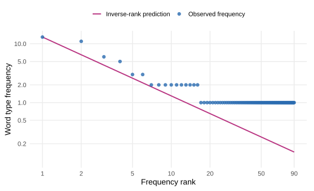

To calculate a rank frequency distribution, we will use George Washington's 1793 inaugural address. This address is one of the texts in quanteda's [corpus of US presidential inaugural addresses](https://quanteda.io/reference/data_corpus_inaugural.html). It is short enough to inspect: after we lowercase the text and remove punctuation, it contains 135 word tokens assigned to 90 word types.

We first count the tokens assigned to each type. We then sort the types from highest frequency to lowest frequency. The most frequent type receives rank 1, the next receives rank 2, and so on.

This inverse relation is the basic form of [**Zipf's law**](https://doi.org/10.3758/s13423-014-0585-6):

$$
f(r)\propto\frac{1}{r^\alpha}.
$$

Here $r$ is a word type's rank, $f(r)$ is its frequency, and $\alpha$ controls how quickly frequency falls as rank rises. A value near one gives the familiar inverse rank pattern.

::: {.callout-note title="Reading: Piantadosi (2014)"}
[Piantadosi, *Zipf's word frequency law in natural language: A critical review and future directions*](https://doi.org/10.3758/s13423-014-0585-6).

Read the introduction, Sections 2 and 3, and the conclusion.

**Why this reading?** The paper starts from a familiar linguistic regularity and asks what would count as an explanation of it. It shows why reproducing the broad rank frequency curve is weak evidence for a proposed mechanism when many different mechanisms produce similar curves.
:::

## Count the tokens in R

The corpus is included with the `quanteda` package. Install the package once with `install.packages("quanteda")`. We can then load the address and count its words with base R functions.

```{r}
#| eval: false
library(quanteda)
data("data_corpus_inaugural", package = "quanteda")

speech <- as.character(
  data_corpus_inaugural["1793-Washington"]
)

normalized <- tolower(
  gsub("[^[:alpha:]']+", " ", speech)
)
word <- strsplit(
  trimws(normalized),
  "[[:space:]]+"
)[[1]]

frequency_table <- sort(
  table(word),
  decreasing = TRUE
)

counts <- data.frame(
  word = names(frequency_table),
  frequency = as.integer(frequency_table)
)
counts <- counts[
  order(-counts$frequency, counts$word),
]
counts$rank <- seq_len(nrow(counts))

head(counts, 10)
```

The first ten rows are:

| word type | frequency | rank |
|---|---:|---:|
| *the* | 13 | 1 |
| *of* | 11 | 2 |
| *i* | 6 | 3 |
| *to* | 5 | 4 |
| *in* | 3 | 5 |
| *shall* | 3 | 6 |
| *am* | 2 | 7 |
| *and* | 2 | 8 |
| *any* | 2 | 9 |
| *be* | 2 | 10 |

Frequency and rank are not independent measurements. Frequency is the token count for a type. Rank is assigned after the types have been ordered by that count.

Ties are common in this address. We order tied types alphabetically so that the result is reproducible. Thus *in* and *shall* receive different ranks even though both occur three times. Reversing their ranks would not change either observed frequency.

## The counting representation

Even this small table depends on several representational choices.

1. What counts as a token? Punctuation marks might be included or removed.
2. What counts as the same type? *run* and *runs* might be separate forms or members of one lemma.
3. What counts as the corpus? One novel, a collection of conversations, and a balanced genre sample represent different populations of tokens.
4. How are ties in frequency ranked?

Different choices produce different frequencies and ranks. Zipf's law describes the resulting token and type representation, not a collection of words that existed independently of those decisions.

Consider lemmatization. If *run*, *runs*, *ran*, and *running* are grouped under one lemma, their counts are added. The lemma may move to a higher rank than any individual form occupied. Other types may then move to lower ranks even though their own token counts did not change.

The analysis should say how tokens were counted, how types were defined, and how ties were ranked.

## Compare the counts with the inverse pattern

For the simplest case, set $\alpha=1$. We can write the proportional relation as

$$
f(r)=\frac{C}{r},
$$

where $C$ is a constant. In the Washington address, *the* has rank 1 and occurs 13 times. Thus

$$
C=f(1)\times1=13.
$$

The curve predicts

$$
\begin{aligned}
f(2)&=13/2=6.5,\\
f(3)&=13/3\approx4.33,\\
f(4)&=13/4=3.25.
\end{aligned}
$$

Compare those predictions with the observed counts.

| rank | observed | simple prediction | observed minus prediction |
|---:|---:|---:|---:|
| 1 | 13 | 13.00 | 0.00 |
| 2 | 11 | 6.50 | 4.50 |
| 3 | 6 | 4.33 | 1.67 |
| 4 | 5 | 3.25 | 1.75 |
| 5 | 3 | 2.60 | 0.40 |
| 6 | 3 | 2.17 | 0.83 |

The mismatch at rank 2 is large: *of* occurs 11 times, while the curve predicts 6.5 occurrences. A corpus with 135 tokens will also have many types that occur only once. The estimated rank frequency distribution is thus much rougher than the distribution from a corpus containing millions of tokens.

The same calculation can be added to the `counts` table.

```{r}
#| eval: false
counts$prediction <- counts$frequency[1] / counts$rank
counts$difference <- counts$frequency - counts$prediction

head(counts, 10)
```

In this calculation, the rank 1 count fixes $C$, and we compare the remaining counts with $C/r$. We do not estimate $\alpha$ or compare alternative explanations of the rank frequency relation.

{width="78%" fig-alt="Word frequency by frequency rank for Washington's 1793 inaugural address, with the inverse-rank prediction shown as a line."}

The individual points are the observed type counts. The line is $13/r$. The axes are logarithmic so that the many low-frequency types remain visible.

## Inspect the broad pattern

Piantadosi plots frequency against rank for a large corpus.

{width="80%" fig-alt="Word frequency plotted against frequency rank."}

The first plot shows the broad inverse relation. The second shows that the observed frequencies do not lie exactly on one ideal curve. The departures are systematic, especially among very frequent and very infrequent types.

{width="80%" fig-alt="Deviation of observed word frequencies from a simple Zipfian curve."}

Piantadosi uses these plots to distinguish two questions.

1. Does an inverse rank frequency curve describe the broad pattern?
2. What process produced the particular frequencies and deviations in this corpus?

The first question is descriptive, whereas the second asks for an explanation.

## Why curve matching does not identify a mechanism

Many proposed mechanisms can produce an approximately Zipfian pattern. They make different claims about memory, lexical organization, communication, and textual growth. If incompatible mechanisms produce the same broad curve, then matching that curve cannot distinguish among them.

Piantadosi argues that an explanatory account must make predictions on which the proposed mechanisms differ. For instance, the mechanisms might predict different relations between meaning and frequency, different changes across genres, or different trajectories for local frequencies within a text.

An inverse rank frequency curve is compatible with several incompatible mechanisms. Observing that curve thus does not tell us which of those mechanisms generated the corpus.

## The descriptive target

For this rank frequency analysis, we can write:

> One observation represents one word type in the chosen corpus. Its response is the number of represented tokens assigned to that type. Rank is assigned after sorting those counts. The target is the relation between rank and frequency under this tokenization, type definition, and corpus sample.

Fitting the curve does not explain lexical choice, memory, or communication. Those claims require observations on which the competing accounts make different predictions.

## Check your understanding

1. Use the R code to identify every type that occurs three times. Explain how the code assigns ranks within this tie.
2. Suppose two forms are combined under one lemma. Explain why the ranks of types outside that lemma may change even if their counts do not.
3. Calculate the inverse-rank prediction for rank 10 and compare it with the observed frequency of *be*.
4. What does a small observed minus predicted value establish? What does it not establish about the source of the pattern?
5. Give one additional prediction that could distinguish two mechanisms that both produce an inverse rank frequency curve.
