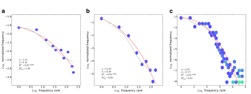
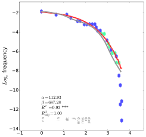
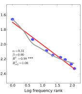

## Describing what happens precisely {.statement-slide}

Probability and statistics is all about describing what happens precisely.

That means stating what can happen and how often it happens.

## This module {.compact}

1. **August 31:** What linguistic data can describe
2. **September 2:** Outcomes, events, and probability spaces
3. **September 9:** Joint, conditional, and independent events

## Welcome {.section-slide}

August 31

## I am Aaron White

I am an associate professor in Linguistics and Computer Science.

My office is 511A Lattimore Hall. My website is [aaronstevenwhite.io](https://aaronstevenwhite.io/).

::: {.notes}
[Sources]

https://aaronstevenwhite.io/
:::

## I am a computational semanticist

I study how words, constructions, and discourses encode events, attitudes, and inferences.

That includes work on how verb meanings relate to syntactic selection, how event structure can be inferred from semantic annotations, and how uncertain inferences update a discourse.

::: {.notes}
[Sources]

https://journals.linguisticsociety.org/proceedings/index.php/SALT/article/view/26.641

https://onlinelibrary.wiley.com/doi/full/10.1111/cogs.12512

https://arxiv.org/abs/2004.04106

https://direct.mit.edu/tacl/article/doi/10.1162/tacl_a_00445/109272/Decomposing-and-Recomposing-Event-Structure

https://juliangrove.github.io/nasslli-2025/
:::

## Statistics connects data to representations

My data include acceptability and inference judgments, corpus distributions, and decompositional semantic annotations.

I use probability and statistics to connect patterns in those observations to hypotheses about the linguistic representations that could have produced them.

## Why take this course? {.statement-slide}

Probability and statistics is all about describing what happens precisely.

That means stating what can happen and how often it happens.

## Articulating a sound

::: {.incremental}
**What can happen?** A speaker can produce many tongue and lip trajectories while articulating a vowel.

**How often?** We can describe how those trajectories are distributed across vowels, speakers, and speaking contexts.

[Random variables and distributions, September 14 to 23](../../random-variables-and-distributions/index.qmd)
:::

## Producing an acoustic signal

::: {.incremental}
**What can happen?** A vowel token can have different durations, formant values, and formant trajectories.

**How often?** We can describe how those measurements are distributed across vowels, speakers, and speaking contexts.

[Statistical inference, September 28 to October 5](../../statistical-inference/index.qmd)
:::

## Reading a sentence

::: {.incremental}
**What can happen?** A comprehender can spend different amounts of time reading a word or sentence region.

**How often?** We can describe how reading times vary with word frequency, syntactic structure, readers, and passages.

[Linear regression and prediction, October 7 to 21](../../regression-models/index.qmd)
:::

## Choosing a construction

::: {.incremental}
**What can happen?** A producer can choose the double object or prepositional dative construction to describe a transfer.

**How often?** We can describe how the probability of each choice varies with the theme, recipient, verb, and discourse context.

[Generalized linear models, November 2 and 4](../../regression-models/why-generalized-linear-models.qmd)
:::

## Giving a slider rating

::: {.incremental}
**What can happen?** A participant can choose the left endpoint, the right endpoint, or an interior slider value.

**How often?** We can describe the probability of each endpoint and the distribution of values in the interior.

[Bounded responses, November 2, 4, 16, and 18](../../regression-models/bounded-responses.qmd)
:::

## Participants and items

::: {.incremental}
**What can happen?** Each pairing of a participant and an item can yield a different response.

**How often?** We can describe how the response distribution varies across participants and items as well as across the conditions we manipulate.

[Mixed effects models, November 16 and 18](../../regression-models/fixed-and-random-effects.qmd)
:::

## Experimental design

::: {.incremental}
**What can happen?** A design determines which conditions each participant and item can appear in and which observations can enter the analysis.

**How often?** Assignment probabilities and replication determine how often the comparisons supported by the design occur.

[Experimental design, November 9 and 11](../../experimental-design/index.qmd)
:::

## Vowel inventories

::: {.incremental}
**What can happen?** An acoustic token can arise from one of several vowel categories that we do not observe directly.

**How often?** We can describe how frequently each category generates a token and how measurements are distributed within each category.

[Latent structure, November 23](../../latent-structure/index.qmd)
:::

## Acceptability lexicons

::: {.incremental}
**What can happen?** A verb-frame combination can receive a range of acceptability judgments.

**How often?** We can describe judgments across verb-frame combinations and ask which recurring patterns support a structured acceptability lexicon.

[Factorization, November 30](../../factorization/valex-megaacceptability.qmd)
:::

## Missing measurements

::: {.incremental}
**What can happen?** A language-feature combination can be observed or missing, and an observed combination can take different values.

**How often?** We can describe how missingness varies with sampling and documentation and how recorded values are distributed.

[Missing data, December 2](../../missing-data/index.qmd)
:::

## Annotations

::: {.incremental}
**What can happen?** An earlier response can determine which question an annotator sees next, and the annotator can then choose among the available responses.

**How often?** We can describe the probability of each path through the task and the responses given by different annotators to different items.

[Custom model design, December 2](../../custom-models/index.qmd)
:::

## Not every object is observed {.statement-slide}

The thing we want to describe and the data we collect to learn about it need not be identical.

## Verb-frame acceptability

We may observe the verb in that frame in a corpus.

We may also observe a participant judge a sentence containing that verb and frame.

Neither observation is identical to the verb's acceptability in that frame.

## Corpus tokens and judgments

A corpus token tells us that a producer used the form in one context.

A judgment tells us how one participant responded to one sentence under one task.

Both may inform an account of acceptability, but through different processes.

## Data and the processes that produce them {.statement-slide}

The course describes both the data we collect and the processes that could have produced those data.

## Six questions organize the course

::: {.incremental}
1. What can happen under the representation?
2. How can a variable describe those possibilities?
3. What does a probability distribution say about the variable?
4. What can a sample tell us about a larger population?
5. How does a model connect a linguistic predictor to a response?
6. How do we check the resulting description?
:::

## Course requirements {.section-slide}

Fall 2026

## We meet on Mondays and Wednesdays

Class meets from **12:30 PM to 1:45 PM** in **Lattimore 513**.

The first meeting is **Monday, August 31**. The final class meeting is **Monday, December 14**.

## Weeks 1 to 4: probability {.compact}

::: {.incremental}
1. **August 31, September 2, and September 9:** linguistic data, probability spaces, and events
2. **September 14 and 16:** random variables and discrete distributions
3. **September 21 and 23:** continuous and joint distributions
:::

## Weeks 5 to 8: inference and prediction {.compact}

::: {.incremental}
1. **September 28 and 30:** populations, samples, and uncertainty
2. **October 5 and 7:** paired inference and linear regression
3. **October 14:** multiple regression and model criticism
4. **October 19 and 21:** prediction, loss, and grouped validation
:::

## October 26 and 28

**Monday, October 26** is the review class.

**Wednesday, October 28** is the midterm and the LING 414 proposal deadline.

## November: responses and data structures {.compact}

::: {.incremental}
1. **November 2 and 4:** binary, count, and bounded responses
2. **November 9 and 11:** experimental design and generalization
3. **November 16 and 18:** mixed models for ordinal and bounded responses
4. **November 23:** clustering and mixture models
5. **November 30:** factorization
:::

## December: missing data and custom models {.compact}

::: {.incremental}
1. **December 2:** missing data and custom model design
2. **December 7, 9, and 14:** LING 414 final project presentations
3. **December 18 to 23:** LING 414 oral assessments
:::

## We do not meet on three scheduled dates

::: {.incremental}
1. **Monday, September 7:** Labor Day
2. **Monday, October 12:** Fall Break
3. **Wednesday, November 25:** Thanksgiving recess
:::

## The course is four credits

We meet for two 75 minute sessions each week.

Plan for at least **480 minutes of work outside class each week** for notes, readings, problem sets, and project work.

LING 110 with a grade of C minus or better is the prerequisite.

## The notes are the course textbook

Each chapter introduces one principal concept and links back to the chapters it requires.

Readings appear in the chapter where they become useful, together with an explanation of what to take from them.

## Three textbooks support the notes {.small}

::: {.incremental}
1. Nicenboim, Schad, and Vasishth, *An Introduction to Bayesian Data Analysis for Cognitive Science*
2. Winter, *Statistics for Linguists: An Introduction Using R*
3. Kruschke, *Doing Bayesian Data Analysis*
:::

The course also uses linguistics papers when their data or arguments bear directly on the method.

## We will work in R

Install **R** and either **RStudio** or **Visual Studio Code**.

Installation instructions and troubleshooting belong on the course Zulip.

## LING 214 has three assessment components {.compact}

| component | weight |
|---|---:|
| five problem sets | 65 percent |
| midterm on October 28 | 25 percent |
| two office hour meetings | 10 percent |

## LING 414 includes a final project {.compact}

| component | weight |
|---|---:|
| five problem sets | 40 percent |
| midterm on October 28 | 20 percent |
| final project | 40 percent |

## Five problem sets {.compact}

::: {.incremental}
1. **Problem Set 1:** October 7, paired vowel measurements
2. **Problem Set 2:** October 21, reading time prediction across passages
3. **Problem Set 3:** November 11, dative construction choice
4. **Problem Set 4:** November 23, discourse commitment judgments
5. **Problem Set 5:** December 7, phonological inventory structure
:::

## Problem sets are readings

Each problem set develops an analysis that the notes prepare you to understand.

Working through the code and interpreting its output are part of learning the next portion of the course.

## Two assessments per problem set

::: {.incremental}
1. Functionality and completeness contribute 50 percent.
2. An in class explanation contributes 50 percent.
:::

Students are selected at random to present and will not know in advance whether they are presenting.

## Be ready to explain your analysis

All students must attend and be prepared to present on any assessment day following a due date.

The assessment concerns what the code does, why the analysis answers the question, and what the result means.

## The LING 414 project has five deadlines {.compact}

::: {.incremental}
1. **October 16:** preproposal meeting completed
2. **October 28:** proposal due
3. **December 7, 9, or 14:** presentation
4. **December 14:** paper and code due
5. **December 18 to 23:** code oral assessment
:::

## LING 414 projects can take three forms

::: {.incremental}
1. A corpus analysis
2. An experiment design with an instrument and simulated analysis
3. A mechanistic interpretation of a deep learning model
:::

The final project rubric states the requirements for each option.

## LING 214 requires two meetings

Office hours are by appointment through the scheduler on my website.

The two meetings may concern course material, a problem set, a possible project, or a statistical question from other work.

## Use Zulip for course communication {.statement-slide}

Do not use email for course communication.

## Use channels for public questions

Post general questions in the appropriate Zulip channel so that everyone can use the answer.

Use a direct message for grades, absences, accommodations, or other private matters.

## Expect replies during working hours

I generally reply within **one to two business days**.

I do not monitor Zulip after **5 PM** or on weekends.

## Late problem sets

A problem set may be submitted at most three days late.

Project components are not accepted late without prior approval. Ask for an extension at least 48 hours before the deadline, except in an emergency.

## Collaboration is encouraged

You may discuss problem sets with classmates, but each student must write and submit their own solution.

Shared discussion should help you understand the analysis well enough to explain it independently.

## Generative AI may assist with code

You may use generative AI for coding assistance on problem sets and projects.

You must understand the resulting code and cite the tool and the specific prompts in code comments. Generative AI may not be used for written assignments.

## The grading scale is fixed {.tiny}

| A | A minus | B plus | B | B minus | C plus | C | C minus | D plus | D | E |
|---:|---:|---:|---:|---:|---:|---:|---:|---:|---:|---:|
| 93 | 90 | 87 | 83 | 80 | 77 | 73 | 70 | 67 | 60 | below 60 |

## Disability accommodations

Students seeking accommodations should contact the University Office of Disability Resources.

Faculty are mandatory reporters for Title IX matters. The syllabus links to the relevant confidential and nonconfidential resources.

## What should you do before September 2?

::: {.incremental}
1. Join the Fall 2026 course Zulip.
2. Confirm that you can open the course notes.
3. Begin installing R and your editor.
4. Read the notes on linguistic data and Zipf's law.
:::

## Describing an entire corpus {.section-slide}

Piantadosi 2014 and Zipf's law

## Zipf's law describes corpus frequencies {.statement-slide}

It relates each word type's frequency to its frequency rank.

## A corpus records what happened

A corpus records a large collection of usages produced by many speakers and writers in many contexts.

We can ask for a precise description of that entire collection.

## Begin by counting word types {.small}

| word type | token count | frequency rank |
|---|---:|---:|
| *the* | 10,000 | 1 |
| *of* | 5,100 | 2 |
| *and* | 3,400 | 3 |

The most frequent type receives rank 1.

## Zipf proposed an inverse relation

If $r$ is a word's frequency rank and $f(r)$ is its frequency, then

$$
f(r)\propto\frac{1}{r^\alpha},
$$

where $\alpha$ is often near 1 for word frequencies.

Piantadosi 2014, Equation 1

::: {.notes}
[Sources]

https://doi.org/10.3758/s13423-014-0585-6
:::

## When $\alpha=1$

If $\alpha=1$ and the first ranked word occurs 10,000 times, then

$$
f(2)=5{,}000
\qquad\text{and}\qquad
f(3)\approx3{,}333.
$$

Frequency falls as rank rises.

## Mandelbrot shifts frequency rank

Piantadosi treats the Zipf and Mandelbrot form as the working description:

$$
f(r)\propto\frac{1}{(r+\beta)^\alpha}.
$$

The additional parameter $\beta$ changes the curve among the highest frequency words.

Piantadosi 2014, Equation 2

::: {.notes}
[Sources]

https://doi.org/10.3758/s13423-014-0585-6
:::

## Why use logarithmic axes?

Both rank and frequency range over several orders of magnitude.

A logarithmic axis allocates comparable space to comparable ratios, such as 10 to 100 and 100 to 1,000.

## The ANC is approximately Zipfian {.figure-slide}

{width="53%" fig-alt="Normalized word frequency plotted against frequency rank for words in the American National Corpus."}

The red curve is the Zipf and Mandelbrot description. The gray curve follows the local average more closely.

Piantadosi 2014, Figure 1a

::: {.notes}
[Sources]

https://doi.org/10.3758/s13423-014-0585-6
:::

## Rank and frequency errors are coupled

If rank and frequency are estimated from the same corpus, their measurement errors are related.

Even equally probable word types will receive different observed ranks after chance differences in their counts.

## Estimate rank and frequency separately

The paper randomly splits the word tokens into two parts.

One part estimates each word's rank. The other estimates its frequency.

A chance fluctuation in one half cannot affect both estimated rank and estimated frequency.

## The broad fit hides departures {.figure-slide}

{width="53%" fig-alt="Difference between observed log word frequency and the Zipf and Mandelbrot curve, plotted against log frequency rank."}

The vertical axis shows the difference between observed log frequency and the curve's prediction.

Piantadosi 2014, Figure 1b

::: {.notes}
[Sources]

https://doi.org/10.3758/s13423-014-0585-6
:::

## Departures from the curve are systematic

The differences form long runs above and below zero, including a large scoop among lower frequency words.

Even the highest frequency words show systematic local structure that the simple curve does not describe.

## The broad fit misses local structure {.statement-slide}

The full word frequency distribution is more complex than the large scale relation between frequency and rank.

## A power law does not identify its cause

Deriving a power law is not enough because many incompatible processes can yield a similar curve.

Piantadosi therefore examines additional properties of word frequencies that distinguish possible explanations.

## Meaning ranks are similar across languages {.figure-slide}

{width="47%" fig-alt="Frequency rank plots for Swadesh list meanings across 17 languages."}

The common rank ordering is estimated across languages. Similar meanings tend to occupy similar portions of the frequency distribution.

Piantadosi 2014, Figure 2

::: {.notes}
[Sources]

https://doi.org/10.3758/s13423-014-0585-6
:::

## Smaller numbers are more frequent {.figure-slide}

{width="86%" fig-alt="Frequency of number words plotted against cardinality in English, Russian, and Italian."}

The horizontal axis is cardinality rather than an independently assigned rank. Smaller numbers receive higher frequencies across English, Russian, and Italian.

Piantadosi 2014, Figure 3

::: {.notes}
[Sources]

https://doi.org/10.3758/s13423-014-0585-6
:::

## Similar referents, unequal frequencies {.figure-slide}

{width="76%" fig-alt="Frequency distributions for taboo words referring to sexual activity and feces."}

Taboo words with roughly shared referential content still show highly unequal frequencies.

Social register and other aspects of use may therefore matter alongside reference.

Piantadosi 2014, Figure 4

::: {.notes}
[Sources]

https://doi.org/10.3758/s13423-014-0585-6
:::

## Constrained referents remain Zipfian {.figure-slide}

{width="88%" fig-alt="Frequency distributions for names of months, planets, and chemical elements."}

Months, planets, and elements give a language relatively little freedom to choose the relevant referents.

Piantadosi 2014, Figure 5

::: {.notes}
[Sources]

https://doi.org/10.3758/s13423-014-0585-6
:::

## Syntactic categories are also Zipfian {.figure-slide}

{width="43%" fig-alt="Frequency distribution of syntactic categories in the Penn Treebank."}

Syntactic category frequencies in the Penn Treebank also form a strongly unequal distribution.

Piantadosi 2014, Figure 6

::: {.notes}
[Sources]

https://doi.org/10.3758/s13423-014-0585-6
:::

## Each category has its own curve {.figure-slide}

{width="73%" fig-alt="Frequency distributions within six Penn Treebank syntactic categories."}

Determiners, prepositions, modals, nouns, and two verb categories differ in their fitted curves and in their systematic departures from those curves.

Piantadosi 2014, Figure 7

::: {.notes}
[Sources]

https://doi.org/10.3758/s13423-014-0585-6
:::

## Frequency varies with context and time

The probability of using *Dallas* differs between a discussion of Lyndon Johnson and a discussion of Carl Sagan.

Topics, social groups, technologies, and historical events all change word frequencies.

## Corpus frequencies average over contexts {.statement-slide}

The simple rank frequency curve describes an aggregate whose components need not follow one unchanging distribution.

## Novel names also show unequal use {.figure-slide}

{width="40%" fig-alt="Average frequency distribution for eight novel alien names used in a story production experiment."}

Twenty-five participants wrote stories of at least 2,000 words using eight novel alien names. The average across participants was near Zipfian.

Piantadosi 2014, Figure 8

::: {.notes}
[Sources]

https://doi.org/10.3758/s13423-014-0585-6
:::

## The within-participant pattern is unknown

Piantadosi averages across participants after ordering each participant's names by frequency.

Larger studies would be needed to establish the pattern reliably within individual participants.

## Zipfian patterns occur outside language

Piantadosi reviews near Zipfian frequency distributions in music, computer programs, and internet systems.

Near-Zipfian distributions across unrelated domains could reflect a general process, or different processes could produce similar aggregate descriptions.

## Random typing reproduces the broad curve

A process that emits characters independently and occasionally emits a space can produce a near Zipfian distribution of resulting strings.

Humans do not produce words by emitting independent characters until a space happens to occur.

## False boundaries preserve the curve {.figure-slide}

{width="43%" fig-alt="Frequency distribution of strings created by treating the letter e as a word boundary in the American National Corpus."}

Treating the letter *e* as a boundary in the American National Corpus still produces a near Zipfian curve.

Piantadosi 2014, Figure 9

::: {.notes}
[Sources]

https://doi.org/10.3758/s13423-014-0585-6
:::

## Curve fit does not validate a process {.statement-slide}

A model can describe the aggregate pattern while misdescribing how speakers produce words.

## Preferential reuse produces inequality

If a word becomes more likely to recur after it has already occurred, a strongly unequal frequency distribution can develop.

But discourse topic may explain both the earlier use and the later reuse. Reuse itself need not be the underlying cause.

## Meaning explains only part of the pattern

Meaning strongly predicts frequency, so an account of word frequency must represent meaning.

But meanings constrained by nature and newly introduced names also produce near Zipfian patterns. Semantic organization alone is therefore incomplete.

## Optimization requires independent evidence

Optimization models can yield Zipfian frequencies by balancing assumptions about speaker and listener costs.

The paper argues that the psychological assumptions and the required parameter values must be tested independently of the resulting curve.

## Universal accounts need new predictions

General arguments from information, computation, or entropy may explain why power laws occur in many systems.

Without new predictions, the observed curve cannot distinguish these accounts from more specific psychological processes.

## The memory account remains a hypothesis

The novel name experiment suggests that memory may contribute to unequal reuse even without an established lexicon.

Piantadosi presents this as a possibility that requires a fuller model and new evidence.

## Explanations need new predictions

::: {.incremental}
1. State a process that could plausibly produce the data
2. Test the assumptions of that process independently
3. Predict observations beyond the rank frequency curve
4. Account for meaning, category, context, time, and novel production
:::

## What happened in the corpus?

**What can happen?** Each speaker or writer can choose a word type in a particular context.

**How often?** Zipf's law describes the aggregate frequencies of those choices across an entire corpus.

## Description is not explanation {.statement-slide}

Describing what can happen and how often it happens does not by itself identify the process that produced the pattern.

## Later modules return to this distinction

::: {.incremental}
1. **October 14:** model criticism asks where a fitted description fails.
2. **October 19 and 21:** prediction asks whether the description extends to new data.
3. **November 30:** factorization describes structured lexical objects.
4. **December 2:** custom model design states processes that could produce complex annotations.
:::

## Four conclusions from August 31

::: {.incremental}
1. Probability and statistics describe what can happen and how often it happens.
2. The object of interest may be more abstract than an observed response.
3. A statistical model can describe an aggregate pattern or a process that produces data.
4. Matching one broad pattern does not by itself identify the process.
:::

## Read before September 2

[Turning linguistic records into data](../../foundations/linguistic-data.qmd)

[Zipf's law](../../foundations/zipfs-law.qmd)

## Probability spaces {.section-slide}

September 2

## Representations determine outcomes

On August 31, we chose what one observation represents.

On September 2, we state what can happen to one represented observation and which distinctions receive probabilities.

## Probability is relative to alternatives {.statement-slide}

Its interpretation depends on the range of possibilities under consideration.

## Start with the possible outcomes

Suppose one observation is one represented English personal pronoun token.

Which forms can the model produce as outcomes?

## Set theory is assumed {.compact}

This module assumes the basic set theory reviewed in [*Languages as formal objects*](https://aaronstevenwhite.io/intro-to-cl/languages-as-formal-objects/).

You should already be comfortable with:

- sets and membership
- subsets and power sets
- union, intersection, difference, and complement

## A sample space lists the outcomes {.compact}

$$
\Omega=\{\textit{I},\textit{me},\textit{you},\textit{he},\textit{him},
\textit{she},\textit{her},\textit{we},\textit{us},\textit{they},\textit{them}\}
$$

The [**sample space**](https://bruno.nicenboim.me/bayescogsci/ch-intro.html) is the set of possible [**outcomes**](https://bruno.nicenboim.me/bayescogsci/ch-intro.html) under the declared representation.

::: {.notes}
[Sources]

https://bruno.nicenboim.me/bayescogsci/ch-intro.html
:::

## Sample spaces depend on representations

$\textit{herself}\notin\Omega$ says that the current model omits *herself*.

It does not say that speakers cannot produce *herself*.

## Granularity changes the outcome {.small}

| represented unit | one possible outcome |
|---|---|
| vowel category | /i/ |
| vowel token | one production of /i/ |
| acoustic measurement | an F1 value |
| acoustic trajectory | a sequence of F1 values |

## Choose the outcome for a vowel study

A vowel study asks whether formant trajectories differ by dialect.

Should one outcome be a vowel category, one F1 value, or a complete trajectory?

## Events as sets {.section-slide}

Which outcomes answer the question in the same way?

## Ask whether the pronoun is third person

Several outcomes give the same answer.

The forms *he*, *her*, and *them* are distinct outcomes, but each is third person.

## An event is a set of outcomes

An [**event**](https://bruno.nicenboim.me/bayescogsci/ch-intro.html) groups outcomes that make a proposition true.

$$
T=\{\textit{he},\textit{him},\textit{she},\textit{her},\textit{they},\textit{them}\}
$$

::: {.notes}
[Sources]

https://bruno.nicenboim.me/bayescogsci/ch-intro.html
:::

## One outcome can belong to several events

Let $A$ be the event that the pronoun is accusative.

The outcome *them* belongs to both $T$ and $A$.

It is still one outcome.

## Set operations combine events

::: {.incremental}
1. $B\cap C$ represents “$B$ and $C$.”
2. $B\cup C$ represents inclusive “$B$ or $C$.”
3. $B^c$ represents “not $B$,” relative to $\Omega$.
:::

## Intersect third person with accusative

If $T$ is third person and $A$ is accusative, then

$$
T\cap A=\{\textit{him},\textit{her},\textit{them}\}.
$$

## Two events are always available

The entire sample space $\Omega$ is the event that some represented outcome occurs.

The empty set $\varnothing$ is the event that no represented outcome occurs.

## Construct events for number and case

Let $P$ be plural and $A$ be accusative.

Write $P\cap A$, $P\cup A$, and $P^c$ for the four outcome pronoun space $\{\textit{he},\textit{him},\textit{they},\textit{them}\}$.

## Measurable events {.section-slide}

Sigma-algebras

## Not every set must be measurable

Suppose the model records plural number but not case.

It can distinguish plural from nonplural forms without distinguishing *they* from *them*.

## A sigma-algebra states what is measurable

A [**sigma-algebra**](https://stats.libretexts.org/Bookshelves/Probability_Theory/Probability_Mathematical_Statistics_and_Stochastic_Processes_%28Siegrist%29/01%3A_Foundations/1.11%3A_Measurable_Spaces) is the collection of events to which a probability model assigns probabilities.

We will write this collection as $\mathcal F$.

::: {.notes}
[Sources]

https://stats.libretexts.org/Bookshelves/Probability_Theory/Probability_Mathematical_Statistics_and_Stochastic_Processes_%28Siegrist%29/01%3A_Foundations/1.11%3A_Measurable_Spaces
:::

## Requirement 1: include the full space

$$
\Omega\in\mathcal F
$$

The model must be able to measure the event that some represented outcome occurs.

## Requirement 2: include complements

If $B\in\mathcal F$, then

$$
B^c\in\mathcal F.
$$

Measuring “plural” requires measuring “not plural.”

## Requirement 3: include countable unions

If $B_1,B_2,\ldots\in\mathcal F$, then

$$
\bigcup_i B_i\in\mathcal F.
$$

Measurable alternatives remain measurable when combined.

## A minimal sigma-algebra for plurality

For plural $P$ in $\Omega_4=\{\textit{he},\textit{him},\textit{they},\textit{them}\}$,

$$
\mathcal F_P=\{\varnothing,P,P^c,\Omega_4\}.
$$

## $\{\Omega_4,P\}$ is not a sigma-algebra

The collection $\{\Omega_4,P\}$ is not a sigma-algebra.

It omits $P^c$ and $\varnothing$.

## Outcomes and measurable events differ

$\Omega$ states which outcomes exist in the representation.

$\mathcal F$ states which groupings of those outcomes can receive probabilities.

## Can $\mathcal F_P$ measure case?

If the event “accusative” is not in $\mathcal F_P$, can the model assign a probability to accusative form?

What additional distinction must the event space retain?

## Generating an event space {.section-slide}

Begin from the distinctions the question needs

## Measure plurality and case

Let $P$ be plural and $A$ be accusative.

We want the smallest sigma-algebra that contains both events.

## Generators specify distinctions

The collection $\{P,A\}$ is a [**generating set**](https://stats.libretexts.org/Bookshelves/Probability_Theory/Probability_Mathematical_Statistics_and_Stochastic_Processes_%28Siegrist%29/01%3A_Foundations/1.11%3A_Measurable_Spaces).

$\sigma(P,A)$ is the smallest sigma-algebra containing both events.

::: {.notes}
[Sources]

https://stats.libretexts.org/Bookshelves/Probability_Theory/Probability_Mathematical_Statistics_and_Stochastic_Processes_%28Siegrist%29/01%3A_Foundations/1.11%3A_Measurable_Spaces
:::

## Cross the two distinctions

Each outcome must fall into one combination of plural or nonplural and accusative or nonaccusative.

These smallest nonempty intersections are the [**atoms**](https://stats.libretexts.org/Bookshelves/Probability_Theory/Probability_Mathematical_Statistics_and_Stochastic_Processes_%28Siegrist%29/01%3A_Foundations/1.11%3A_Measurable_Spaces).

::: {.notes}
[Sources]

https://stats.libretexts.org/Bookshelves/Probability_Theory/Probability_Mathematical_Statistics_and_Stochastic_Processes_%28Siegrist%29/01%3A_Foundations/1.11%3A_Measurable_Spaces
:::

## Find the atoms {.compact}

$$
P\cap A=\{\textit{them}\},\qquad P\cap A^c=\{\textit{they}\},
$$

$$
P^c\cap A=\{\textit{him}\},\qquad P^c\cap A^c=\{\textit{he}\}.
$$

## Atoms generate measurable events

Every atom is a singleton in this four outcome space.

Every subset is therefore a union of atoms, so

$$
\sigma(P,A)=2^{\Omega_4}.
$$

## A coarse generator omits case

Generating from $P$ alone cannot distinguish *they* from *them*.

More observations do not repair a distinction omitted by the representation.

## Assign probabilities to events {.section-slide}

Probability measures

## Begin with mass on the outcomes {.small}

| outcome | probability |
|---|---:|
| *he* | $.20$ |
| *him* | $.30$ |
| *they* | $.10$ |
| *them* | $.40$ |

## Probability measures assign mass

A [**probability measure**](https://stats.libretexts.org/Bookshelves/Probability_Theory/Probability_Mathematical_Statistics_and_Stochastic_Processes_%28Siegrist%29/02%3A_Probability_Spaces/2.09%3A_Probability_Spaces_Revisited) maps measurable events to numbers.

$$
\mathbb P:\mathcal F\rightarrow[0,1]
$$

::: {.notes}
[Sources]

https://stats.libretexts.org/Bookshelves/Probability_Theory/Probability_Mathematical_Statistics_and_Stochastic_Processes_%28Siegrist%29/02%3A_Probability_Spaces/2.09%3A_Probability_Spaces_Revisited
:::

## The probability space has three parts

The triple

$$
\langle\Omega,\mathcal F,\mathbb P\rangle
$$

is a [**probability space**](https://bruno.nicenboim.me/bayescogsci/ch-intro.html).

::: {.notes}
[Sources]

https://bruno.nicenboim.me/bayescogsci/ch-intro.html
:::

## Requirement 1: nonnegativity

For every $B\in\mathcal F$,

$$
\mathbb P(B)\geq0.
$$

## Requirement 2: total probability is one

$$
\mathbb P(\Omega)=1.
$$

The represented possibilities exhaust the probability mass.

## Requirement 3: countable additivity

For pairwise disjoint events $B_1,B_2,\ldots$,

$$
\mathbb P\left(\bigcup_i B_i\right)=\sum_i\mathbb P(B_i).
$$

## Compute one event probability

For $A=\{\textit{him},\textit{them}\}$,

$$
\mathbb P(A)=.30+.40=.70.
$$

## Do the probabilities sum to one?

Four exhaustive outcomes receive probabilities $.40$, $.35$, $.20$, and $.10$.

Can these values define a probability measure? Which requirement fails?

## September 2: the probability space

::: {.incremental}
1. $\Omega$ states the represented outcomes.
2. Events translate linguistic questions into sets.
3. $\mathcal F$ states which events are measurable.
4. $\mathbb P$ assigns coherent mass to those events.
:::

## Read the probability space notes

[Sample spaces](../../foundations/possibilities-and-events.qmd)

[Events](../../foundations/events.qmd)

[Sigma-algebras](../../foundations/event-spaces.qmd)

[Probability measures](../../foundations/probability-measures.qmd)

## Relations among events {.section-slide}

September 9

## The four-outcome probability space {.small}

| outcome | number | case | probability |
|---|---|---|---:|
| *he* | singular | nominative | $.20$ |
| *him* | singular | accusative | $.30$ |
| *they* | plural | nominative | $.10$ |
| *them* | plural | accusative | $.40$ |

## When do probabilities add? {.section-slide}

Mutual exclusivity

## Some events cannot occur together

One pronoun outcome cannot be both nominative and accusative in this representation.

The two events have no outcomes in common.

## Mutually exclusive events do not overlap

Events $B$ and $C$ are [**mutually exclusive**](https://bruno.nicenboim.me/bayescogsci/ch-intro.html) when

$$
B\cap C=\varnothing.
$$

::: {.notes}
[Sources]

https://bruno.nicenboim.me/bayescogsci/ch-intro.html
:::

## Disjoint event probabilities add

If $B\cap C=\varnothing$, then

$$
\mathbb P(B\cup C)=\mathbb P(B)+\mathbb P(C).
$$

## Overlap must be subtracted once

For events that can occur together,

$$
\mathbb P(B\cup C)
=\mathbb P(B)+\mathbb P(C)-\mathbb P(B\cap C).
$$

## Labels do not determine exclusivity

“Plural” and “accusative” are different labels, but *them* belongs to both events.

The represented outcomes determine whether the intersection is empty.

## Joint probability {.section-slide}

Plurality and case together

## The joint event is an intersection

The [**joint probability**](https://bruno.nicenboim.me/bayescogsci/ch-intro.html) of $P$ and $A$ is

$$
\mathbb P(P\cap A).
$$

::: {.notes}
[Sources]

https://bruno.nicenboim.me/bayescogsci/ch-intro.html
:::

## Compute the joint probability

The event $P\cap A$ contains only *them*.

Thus

$$
\mathbb P(P\cap A)=.40.
$$

## A joint-probability table {.small}

| | accusative $A$ | nominative $A^c$ | total |
|---|---:|---:|---:|
| plural $P$ | $.40$ | $.10$ | $.50$ |
| singular $P^c$ | $.30$ | $.20$ | $.50$ |
| total | $.70$ | $.30$ | $1$ |

## Margins give marginal probabilities

[**Marginal probabilities**](https://bruno.nicenboim.me/bayescogsci/ch-intro.html) appear in the table margins.

$$
\mathbb P(P)=.40+.10=.50
$$

::: {.notes}
[Sources]

https://bruno.nicenboim.me/bayescogsci/ch-intro.html
:::

## Conditional probability {.section-slide}

Conditional probability

## Condition on plural pronouns

Among plural pronouns, how much of the probability belongs to accusative forms?

The phrase “among plural pronouns” makes $P$ the reference event.

## Rescale within the plural event {.small}

| plural outcome | probability in $\Omega_4$ | probability within $P$ |
|---|---:|---:|
| *they* | $.10$ | $.10/.50=.20$ |
| *them* | $.40$ | $.40/.50=.80$ |

## Conditional probability rescales

The [**conditional probability**](https://bruno.nicenboim.me/bayescogsci/ch-intro.html) of $A$ given $P$ is

$$
\mathbb P(A\mid P)=\frac{\mathbb P(A\cap P)}{\mathbb P(P)}.
$$

::: {.notes}
[Sources]

https://bruno.nicenboim.me/bayescogsci/ch-intro.html
:::

## Compute the conditional probability

$$
\begin{aligned}
\mathbb P(A\mid P)
&=\frac{.40}{.50}\\
&=.80.
\end{aligned}
$$

## The condition sets the denominator

$$
\mathbb P(P\mid A)=\frac{.40}{.70}\approx.57.
$$

The overlap stays the same. The reference event changes.

## Read the condition first

For $\mathbb P(A\mid P)$,

1. restrict attention to $P$,
2. then ask what portion also belongs to $A$.

## Conditional probabilities are directional

Most passive clauses may have animate subjects.

It does not follow that most clauses with animate subjects are passive.

## Recover the joint probability {.section-slide}

The product rule

## Rearrange the definition

Starting from

$$
\mathbb P(A\mid P)=\frac{\mathbb P(A\cap P)}{\mathbb P(P)},
$$

multiply both sides by $\mathbb P(P)$.

## The product rule

The [**product rule**](https://bruno.nicenboim.me/bayescogsci/ch-intro.html) gives

$$
\mathbb P(A\cap P)=\mathbb P(A\mid P)\mathbb P(P).
$$

::: {.notes}
[Sources]

https://bruno.nicenboim.me/bayescogsci/ch-intro.html
:::

## Interpret the product with 100 tokens

::: {.incremental}
1. Fifty of 100 tokens are plural.
2. Forty of those 50 plural tokens are accusative.
3. Thus 40 of 100 tokens are both plural and accusative.
:::

## Compute the product

$$
\begin{aligned}
\mathbb P(A\cap P)
&=.80\times.50\\
&=.40.
\end{aligned}
$$

## Reverse the factor order

The same intersection can be written

$$
\mathbb P(A\cap P)=\mathbb P(P\mid A)\mathbb P(A).
$$

Both products recover $.40$.

## A product does not assert independence {.statement-slide}

The product rule contains a conditional probability. It allows the events to be associated.

## Bayes' rule {.section-slide}

Reversing a conditional probability

## Two products, one intersection

$$
\mathbb P(B\mid C)\mathbb P(C)
=\mathbb P(C\mid B)\mathbb P(B).
$$

Both sides equal $\mathbb P(B\cap C)$.

## Bayes' rule

[**Bayes' rule**](https://bruno.nicenboim.me/bayescogsci/ch-intro.html) solves the equality for one conditional probability.

$$
\mathbb P(B\mid C)
=\frac{\mathbb P(C\mid B)\mathbb P(B)}{\mathbb P(C)}.
$$

::: {.notes}
[Sources]

https://bruno.nicenboim.me/bayescogsci/ch-intro.html
:::

## A common feature, a small group {.small}

| | feature $F$ | no feature $F^c$ | total |
|---|---:|---:|---:|
| dialect group $D$ | 90 | 10 | 100 |
| other group $D^c$ | 180 | 720 | 900 |
| total | 270 | 730 | 1,000 |

## The feature is common within group $D$

$$
\mathbb P(F\mid D)=\frac{90}{100}=.90.
$$

The denominator is the 100 members of the dialect group.

## Most feature tokens are outside group $D$

$$
\mathbb P(D\mid F)=\frac{90}{270}=\frac13.
$$

The denominator is the 270 tokens with the feature.

## Bayes' rule accounts for group prevalence

$$
\mathbb P(D\mid F)
=\frac{\mathbb P(F\mid D)\mathbb P(D)}{\mathbb P(F)}
=\frac{.90\times.10}{.27}
=\frac13.
$$

## Independence {.section-slide}

Does conditioning change probability?

## Compare the joint to the margins

Events $B$ and $C$ are [**independent**](https://bruno.nicenboim.me/bayescogsci/ch-intro.html) when

$$
\mathbb P(B\cap C)=\mathbb P(B)\mathbb P(C).
$$

::: {.notes}
[Sources]

https://bruno.nicenboim.me/bayescogsci/ch-intro.html
:::

## The pronoun events are not independent

$$
\mathbb P(P)\mathbb P(A)=.50\times.70=.35
$$

but

$$
\mathbb P(P\cap A)=.40.
$$

## Independence also has a conditional form

When $\mathbb P(C)>0$, independence implies

$$
\mathbb P(B\mid C)=\mathbb P(B).
$$

Learning that $C$ occurred does not change the probability of $B$.

## Make the events independent {.small}

| | accusative $A$ | nominative $A^c$ | total |
|---|---:|---:|---:|
| plural $P$ | $.35$ | $.15$ | $.50$ |
| singular $P^c$ | $.35$ | $.15$ | $.50$ |
| total | $.70$ | $.30$ | $1$ |

## Independence depends on $\mathbb P$

The event labels are unchanged across the two tables.

The arrangement of probability mass determines whether the events are independent.

## Independence is not mutual exclusivity

Mutually exclusive events with positive probability cannot be independent.

Observing one event rules out the other.

## Exclusivity is not independence

Explain why

1. $\mathbb P(B\cap C)=0$ expresses mutual exclusivity, while
2. $\mathbb P(B\cap C)=\mathbb P(B)\mathbb P(C)$ expresses independence.

## Module summary {.section-slide}

From records to probability spaces

## What a probability statement requires {.compact}

::: {.incremental}
1. A unit that states what one observation represents
2. A sample space that states the possible outcomes
3. Events that express the linguistic distinctions of interest
4. A sigma-algebra that states which events are measurable
5. A probability measure that assigns coherent mass
:::

## What does each probability ask?

::: {.incremental}
1. $\mathbb P(B\cap C)$ asks how much mass belongs to both events.
2. $\mathbb P(B\mid C)$ asks how much of event $C$ also belongs to $B$.
3. Independence asks whether conditioning on $C$ changes the probability of $B$.
:::

## Models preserve represented distinctions {.statement-slide}

Those distinctions must be retained by the data representation and declared by its probability space.

## Continue in the notes

[From linguistic records to probabilities](../../foundations/index.qmd)
